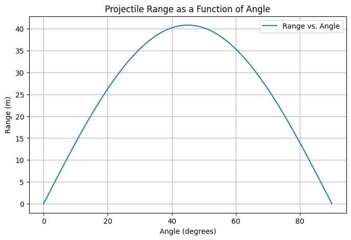

## Investigating the Range as a Function of the Angle of Projection

### **1. Motivation**

Projectile motion provides a simple yet insightful framework for understanding physics concepts. The range of a projectile depends on its angle of projection, influenced by factors like initial velocity and gravitational acceleration. Understanding these dependencies is crucial for applications in sports, engineering, and astrophysics.

---

### **2. Theoretical Foundation**

#### **Equations of Motion:**

- **Horizontal Motion:**  
  $$ x = v_0 \cos\theta \cdot t $$
- **Vertical Motion:**  
  $$ y = v_0 \sin\theta \cdot t - \frac{1}{2} g t^2 $$
- **Time of Flight:**  
  $$ T = \frac{2 v_0 \sin\theta}{g} $$
- **Range Formula:**  
  $$ R = \frac{v_0^2 \sin 2\theta}{g} $$

#### **Key Insights:**

- Maximum range at $$ \theta = 45^\circ $$.
- Symmetry around $$ 45^\circ $$.
- Higher $$ v_0 $$ increases range quadratically.

---

### **3. Analysis of the Range**

- **Effect of Initial Velocity ($$ v_0 $$)**: Increases range quadratically.
- **Effect of Gravity ($$ g $$)**: Higher $$ g $$ reduces range.
- **Effect of Launch Height ($$ h $$)**: Changes trajectory significantly.

---

### **4. Practical Applications**

- **Sports**: Optimizing angles for maximum distance in soccer, basketball, and javelin throw.
- **Engineering**: Designing projectile paths for missiles and ballistics.
- **Astrophysics**: Calculating trajectories of celestial bodies.

---

### **5. Implementation (Python Simulation)**

```python
import numpy as np
import matplotlib.pyplot as plt

g = 9.81  # Gravity (m/s^2)
v0 = 20   # Initial velocity (m/s)
angles = np.linspace(0, 90, 100)
ranges = (v0**2 * np.sin(2 * np.radians(angles))) / g

plt.plot(angles, ranges, label="Range vs. Angle")
plt.xlabel("Angle (degrees)")
plt.ylabel("Range (m)")
plt.title("Projectile Range as a Function of Angle")
plt.legend()
plt.grid()
plt.show()
```



---

### **6. Limitations & Extensions**

- **No air resistance**: Real-world projectiles experience drag.
- **Uneven terrain**: Requires numerical integration.
- **Wind effects**: Adds horizontal acceleration component.

#### **Future Work:**

🔹 Incorporate **air resistance** and **variable terrain effects** for realism.
