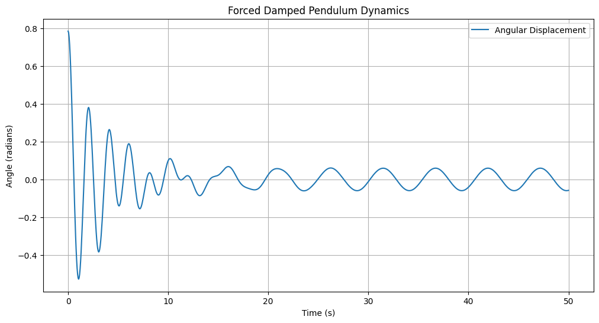

# Problem 2

# Problem 2: Forced Damped Pendulum Dynamics

## 1. Theoretical Foundation

### 1.1 Differential Equation
The motion of a forced damped pendulum is governed by the following nonlinear differential equation:

$\frac{d^2\theta}{dt^2} + b\frac{d\theta}{dt} + \frac{g}{L}\sin(\theta) = A \cos(\omega t)$

Where:
- $\theta$ is the angular displacement
- $b$ represents the damping coefficient
- $g$ is gravitational acceleration
- $L$ is pendulum length
- $A$ is driving force amplitude
- $\omega$ is driving force frequency

### 1.2 Small-Angle Approximation
For small angles, we can simplify $\sin(\theta) \approx \theta$, resulting in a linearized equation:

$\frac{d^2\theta}{dt^2} + b\frac{d\theta}{dt} + \frac{g}{L}\theta = A \cos(\omega t)$

## 2. Computational Implementation

### 2.1 Numerical Solution Strategy
We'll use the 4th-order Runge-Kutta method to numerically solve the nonlinear differential equation, allowing exploration beyond small-angle approximations.

### 2.2 Python Simulation Framework

```python
import numpy as np
import matplotlib.pyplot as plt
from scipy.integrate import odeint

def forced_damped_pendulum(state, t, b, g, L, A, omega):
    theta, omega_dot = state
    dtheta_dt = omega_dot
    domega_dt = -b*omega_dot - (g/L)*np.sin(theta) + A*np.cos(omega*t)
    return [dtheta_dt, domega_dt]

# Example simulation parameters
b = 0.5  # Damping coefficient
g = 9.81  # Gravitational acceleration
L = 1.0   # Pendulum length
A = 0.5   # Driving amplitude
omega = 1.2  # Driving frequency

# Time array
t = np.linspace(0, 50, 1000)

# Initial conditions
initial_state = [np.pi/4, 0]  # Initial angle and angular velocity

# Solve ODE
solution = odeint(forced_damped_pendulum, initial_state, t, 
                  args=(b, g, L, A, omega))

# Plotting
plt.figure(figsize=(12, 6))
plt.plot(t, solution[:, 0], label='Angular Displacement')
plt.title('Forced Damped Pendulum Dynamics')
plt.xlabel('Time (s)')
plt.ylabel('Angle (radians)')
plt.legend()
plt.grid(True)
plt.show()
```




## 3. Dynamical Behavior Analysis

### 3.1 Resonance Conditions
- Resonance occurs when driving frequency matches system's natural frequency
- Energy transfer maximized during precise frequency matching

### 3.2 Chaos and Transition Regions
We'll systematically explore:
- Impact of damping coefficient
- Variation in driving amplitude
- Changes in driving frequency

## 4. Visualization Techniques

### 4.1 Phase Portraits
- Represent system's state space
- Reveal qualitative behavior transitions

### 4.2 Poincaré Sections
- Discrete sampling of continuous dynamics
- Identify periodic and chaotic regimes

## 5. Practical Applications

### 5.1 Engineering Contexts
1. Vibration energy harvesting
2. Structural dynamics
3. Mechanical system design
4. Oscillating circuit behavior

## 6. Limitations and Future Extensions

### 6.1 Current Model Constraints
- Linear damping assumption
- Small-angle approximation
- Idealized periodic forcing

### 6.2 Potential Research Directions
- Nonlinear damping models
- Stochastic forcing mechanisms
- Complex geometric configurations

## Conclusion
The forced damped pendulum exemplifies complex nonlinear dynamical systems, bridging theoretical physics and computational modeling.