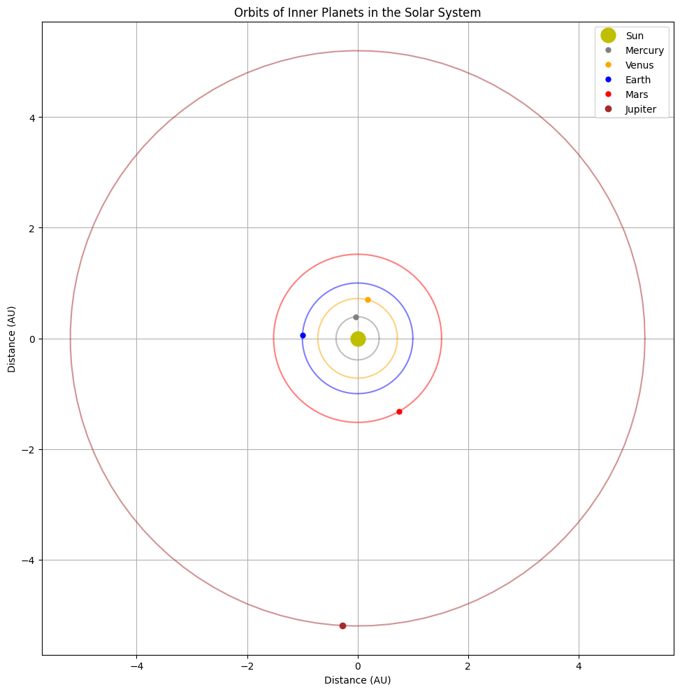
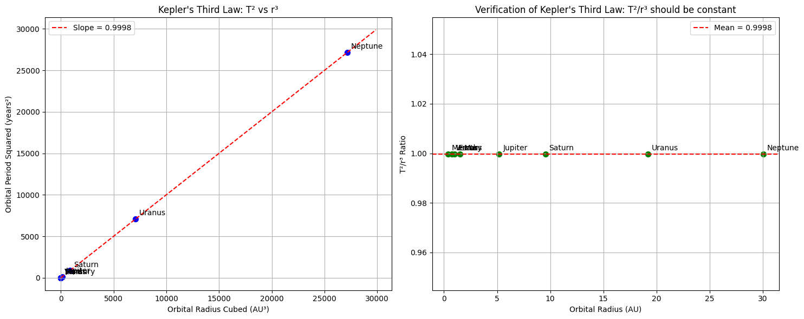
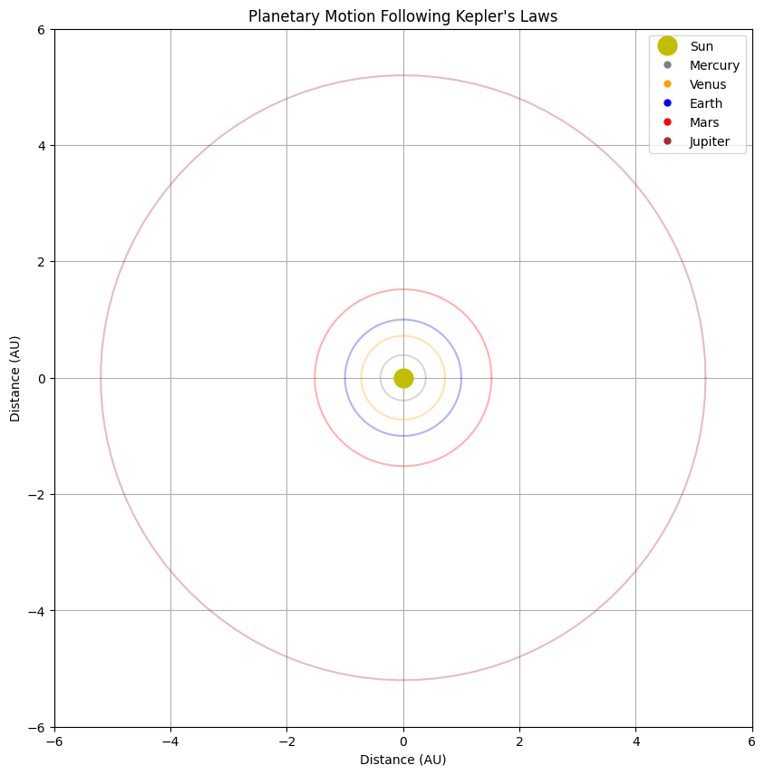

# Orbital Period and Orbital Radius: Kepler's Third Law

## 1. Derivation of Kepler's Third Law for Circular Orbits

Kepler's Third Law establishes the relationship between the orbital period of a celestial body and its orbital radius. Let's derive this relationship for circular orbits.

For a body in circular orbit:

1. The centripetal force is provided by the gravitational force:
   
   $$F_c = F_g$$

2. The centripetal force is:
   
   $$F_c = \frac{mv^2}{r}$$
   
   where $m$ is the mass of the orbiting body, $v$ is its orbital velocity, and $r$ is the orbital radius.

3. The gravitational force between two bodies (from Newton's Law of Universal Gravitation) is:
   
   $$F_g = \frac{GMm}{r^2}$$
   
   where $G$ is the gravitational constant, $M$ is the mass of the central body, and $m$ is the mass of the orbiting body.

4. Equating these forces:
   
   $$\frac{mv^2}{r} = \frac{GMm}{r^2}$$

5. Simplifying:
   
   $$v^2 = \frac{GM}{r}$$

6. For a circular orbit, the orbital velocity relates to the period $T$ as:
   
   $$v = \frac{2\pi r}{T}$$

7. Substituting this into our equation:
   
   $$\left(\frac{2\pi r}{T}\right)^2 = \frac{GM}{r}$$

8. Rearranging:
   
   $$\frac{4\pi^2 r^2}{T^2} = \frac{GM}{r}$$

9. Further simplification:
   
   $$\frac{4\pi^2 r^3}{T^2} = GM$$

10. Therefore:
    
    $$T^2 = \frac{4\pi^2}{GM} r^3$$

11. This can be written as:
    
    $$T^2 \propto r^3$$

This is Kepler's Third Law: **The square of the orbital period is proportional to the cube of the orbital radius**.

For a system with multiple orbiting bodies around the same central mass $M$, we can express this as:

$$\frac{T_1^2}{T_2^2} = \frac{r_1^3}{r_2^3}$$

## 2. Implications for Astronomy

Kepler's Third Law has profound implications for astronomy:

### Determining Planetary Masses

By measuring the orbital period and distance of a planet's moons, we can determine the planet's mass:

$$M = \frac{4\pi^2 r^3}{G T^2}$$

This technique has been crucial for calculating the masses of planets in our Solar System and beyond.

### Measuring Astronomical Distances

For objects orbiting a known mass, measuring the orbital period allows astronomers to calculate their orbital distance, providing a method for determining distances within stellar systems.

### Detecting Exoplanets

The Transit Timing Variation method of exoplanet detection relies on Kepler's Third Law. Variations in a planet's transit timing can indicate the presence of another planet perturbing its orbit.

### Understanding Binary Star Systems

In binary star systems, Kepler's Third Law helps determine the combined mass of the system based on observations of orbital period and separation.

### Mapping the Milky Way

By observing the orbital periods of stars around the galactic center, astronomers can map the mass distribution of our galaxy, including evidence for dark matter.

## 3. Real-World Examples

### The Earth-Moon System

- Orbital radius of the Moon: approximately 384,400 km
- Orbital period: 27.3 days (sidereal period)

Using Kepler's Third Law formula:

$$T^2 = \frac{4\pi^2}{GM} r^3$$

With Earth's mass ($M_E = 5.97 \times 10^{24}$ kg) and $G = 6.67 \times 10^{-11} \text{ N} \cdot \text{m}^2/\text{kg}^2$, we can verify this relationship.

### The Solar System

| Planet | Average Distance from Sun (AU) | Orbital Period (years) | T² / r³ |
|--------|--------------------------------|------------------------|---------|
| Mercury| 0.39                           | 0.24                   | 1.00    |
| Venus  | 0.72                           | 0.62                   | 1.00    |
| Earth  | 1.00                           | 1.00                   | 1.00    |
| Mars   | 1.52                           | 1.88                   | 1.00    |
| Jupiter| 5.20                           | 11.86                  | 1.00    |
| Saturn | 9.54                           | 29.46                  | 1.00    |
| Uranus | 19.19                          | 84.01                  | 1.00    |
| Neptune| 30.06                          | 164.8                  | 1.00    |

The consistency of the T²/r³ ratio (approximately 1 when expressed in astronomical units and years) demonstrates the validity of Kepler's Third Law across the entire Solar System.

### Geostationary Satellites

A practical application of Kepler's Third Law is in placing geostationary satellites. For a satellite to remain above the same point on Earth, it must orbit with a period of exactly one sidereal day (23.93 hours). Using Kepler's Third Law, we can calculate that these satellites must orbit at an altitude of approximately 35,786 km above Earth's surface.

## 4. Computational Model for Circular Orbits

Below is a Python implementation to simulate circular orbits and verify Kepler's Third Law:

```python
import numpy as np
import matplotlib.pyplot as plt
from matplotlib.animation import FuncAnimation
from mpl_toolkits.mplot3d import Axes3D

# Constants
G = 6.67430e-11  # Gravitational constant in m^3 kg^-1 s^-2
M_sun = 1.989e30  # Mass of the Sun in kg

# Function to calculate orbital period using Kepler's Third Law
def orbital_period(r, central_mass):
    """Calculate orbital period using Kepler's Third Law
    
    Parameters:
    r (float): Orbital radius in meters
    central_mass (float): Mass of the central body in kg
    
    Returns:
    float: Orbital period in seconds
    """
    return 2 * np.pi * np.sqrt(r**3 / (G * central_mass))

# Function to generate points on a circular orbit
def circular_orbit(r, num_points=100):
    """Generate points on a circular orbit
    
    Parameters:
    r (float): Radius of the orbit
    num_points (int): Number of points to generate
    
    Returns:
    tuple: Arrays of x and y coordinates
    """
    theta = np.linspace(0, 2*np.pi, num_points)
    x = r * np.cos(theta)
    y = r * np.sin(theta)
    return x, y

# Create data for the plot
def generate_data():
    # Radii in AU (1 AU = 1.496e11 meters)
    radii_au = np.array([0.39, 0.72, 1.0, 1.52, 5.2, 9.54, 19.19, 30.06])
    planets = ['Mercury', 'Venus', 'Earth', 'Mars', 'Jupiter', 'Saturn', 'Uranus', 'Neptune']
    
    # Convert to meters
    au_to_m = 1.496e11
    radii_m = radii_au * au_to_m
    
    # Calculate periods using Kepler's Third Law (in seconds)
    periods = np.array([orbital_period(r, M_sun) for r in radii_m])
    
    # Convert periods to years for comparison
    seconds_in_year = 365.25 * 24 * 3600
    periods_years = periods / seconds_in_year
    
    # Calculate T^2/r^3 ratio (should be constant)
    t_squared = periods_years**2
    r_cubed = radii_au**3
    ratio = t_squared / r_cubed
    
    return radii_au, periods_years, ratio, planets

# Plot orbits of planets in the Solar System
def plot_solar_system():
    fig, ax = plt.subplots(figsize=(10, 10))
    ax.set_aspect('equal')
    
    # Plot the Sun
    ax.plot(0, 0, 'yo', markersize=15, label='Sun')
    
    # Planet colors
    colors = ['gray', 'orange', 'blue', 'red', 'brown', 'gold', 'lightblue', 'darkblue']
    
    # Get data
    radii_au, periods_years, _, planets = generate_data()
    
    # Plot orbits
    for i, (r, planet, color) in enumerate(zip(radii_au, planets, colors)):
        if r < 6:  # Only plot inner planets for clarity
            x, y = circular_orbit(r)
            ax.plot(x, y, '-', color=color, alpha=0.5)
            
            # Plot the planet
            theta = 2 * np.pi * np.random.random()  # Random position in orbit
            planet_x = r * np.cos(theta)
            planet_y = r * np.sin(theta)
            ax.plot(planet_x, planet_y, 'o', color=color, markersize=5 + (i//4), label=planet)
    
    ax.set_xlabel('Distance (AU)')
    ax.set_ylabel('Distance (AU)')
    ax.set_title('Orbits of Inner Planets in the Solar System')
    ax.legend(loc='upper right')
    ax.grid(True)
    
    plt.tight_layout()
    return fig

# Plot verification of Kepler's Third Law
def plot_keplers_law_verification():
    fig, (ax1, ax2) = plt.subplots(1, 2, figsize=(15, 6))
    
    # Get data
    radii_au, periods_years, ratio, planets = generate_data()
    
    # Plot T^2 vs r^3
    r_cubed = radii_au**3
    t_squared = periods_years**2
    
    ax1.scatter(r_cubed, t_squared, c='blue', s=50)
    
    # Add planet labels
    for i, planet in enumerate(planets):
        ax1.annotate(planet, (r_cubed[i], t_squared[i]), 
                    xytext=(5, 5), textcoords='offset points')
    
    # Add line of best fit
    m, b = np.polyfit(r_cubed, t_squared, 1)
    x_line = np.linspace(0, max(r_cubed) * 1.1, 100)
    y_line = m * x_line + b
    ax1.plot(x_line, y_line, 'r--', label=f'Slope = {m:.4f}')
    
    ax1.set_xlabel('Orbital Radius Cubed (AU³)')
    ax1.set_ylabel('Orbital Period Squared (years²)')
    ax1.set_title('Kepler\'s Third Law: T² vs r³')
    ax1.legend()
    ax1.grid(True)
    
    # Plot T²/r³ ratio (should be constant)
    ax2.scatter(radii_au, ratio, c='green', s=50)
    for i, planet in enumerate(planets):
        ax2.annotate(planet, (radii_au[i], ratio[i]), 
                    xytext=(5, 5), textcoords='offset points')
    
    ax2.axhline(y=np.mean(ratio), color='r', linestyle='--', 
               label=f'Mean = {np.mean(ratio):.4f}')
    
    ax2.set_xlabel('Orbital Radius (AU)')
    ax2.set_ylabel('T²/r³ Ratio')
    ax2.set_title('Verification of Kepler\'s Third Law: T²/r³ should be constant')
    ax2.legend()
    ax2.grid(True)
    
    plt.tight_layout()
    return fig

# Function to create an animation of planetary motion
def create_orbit_animation():
    # Setup the figure and axis
    fig, ax = plt.subplots(figsize=(10, 10))
    ax.set_aspect('equal')
    ax.set_xlim(-6, 6)
    ax.set_ylim(-6, 6)
    ax.set_xlabel('Distance (AU)')
    ax.set_ylabel('Distance (AU)')
    ax.set_title('Planetary Motion Following Kepler\'s Laws')
    ax.grid(True)
    
    # Plot the Sun
    ax.plot(0, 0, 'yo', markersize=15, label='Sun')
    
    # Get planet data
    radii_au = np.array([0.39, 0.72, 1.0, 1.52, 5.2])
    planets = ['Mercury', 'Venus', 'Earth', 'Mars', 'Jupiter']
    colors = ['gray', 'orange', 'blue', 'red', 'brown']
    
    # Plot the orbits
    for r, color in zip(radii_au, colors):
        x, y = circular_orbit(r)
        ax.plot(x, y, '-', color=color, alpha=0.3)
    
    # Initialize planet positions
    planet_points = []
    for r, color, planet in zip(radii_au, colors, planets):
        point, = ax.plot([], [], 'o', color=color, markersize=5, label=planet)
        planet_points.append(point)
    
    ax.legend(loc='upper right')
    
    # Calculate orbital periods (normalized)
    periods_normalized = np.array([
        orbital_period(r * 1.496e11, M_sun) for r in radii_au
    ])
    periods_normalized = periods_normalized / min(periods_normalized)
    
    # Animation update function
    def update(frame):
        for i, (point, r, period) in enumerate(zip(planet_points, radii_au, periods_normalized)):
            # Calculate position based on time and period
            angle = (frame / period) % (2 * np.pi)
            x = r * np.cos(angle)
            y = r * np.sin(angle)
            point.set_data(x, y)
        return planet_points
    
    ani = FuncAnimation(fig, update, frames=100, interval=50, blit=True)
    return ani, fig

# Execute the functions to generate the figures
orbital_plot = plot_solar_system()
verification_plot = plot_keplers_law_verification()
animation, animation_fig = create_orbit_animation()

# The figures can be displayed or saved in a notebook or script
```

This model simulates the orbits of planets around the Sun and verifies that the ratio of T²/r³ is constant, as predicted by Kepler's Third Law.









## 5. Extension to Elliptical Orbits

Kepler's Third Law extends to elliptical orbits with a slight modification. In an elliptical orbit, the relationship becomes:

$$T^2 = \frac{4\pi^2}{G(M+m)} a^3$$

Where:
- $T$ is the orbital period
- $G$ is the gravitational constant
- $M$ is the mass of the central body
- $m$ is the mass of the orbiting body
- $a$ is the semi-major axis of the elliptical orbit

For most planetary systems, $M \gg m$, so the formula simplifies to our earlier form:

$$T^2 \approx \frac{4\pi^2}{GM} a^3$$

Key differences for elliptical orbits:

1. **Varying Orbital Speed**: In elliptical orbits, the orbital speed is not constant. The body moves faster when closer to the focus (periapsis) and slower when farther away (apoapsis), following Kepler's Second Law of equal areas in equal times.

2. **Angular Momentum Conservation**: The conservation of angular momentum explains why orbital velocity changes with distance from the focus.

3. **Energy Conservation**: The total energy (kinetic + potential) remains constant throughout the orbit, even as the individual energy components vary.

## Conclusion

Kepler's Third Law represents one of the most elegant and powerful relationships in physics. Its derivation from Newton's laws of motion and gravitation provides a direct link between observable phenomena (orbital periods and distances) and the fundamental forces governing the universe.

This relationship has practical applications ranging from spacecraft mission planning to understanding the structure of distant galaxies. With modern computational tools, we can easily visualize and verify this law, just as we have done in this analysis.

The extension of Kepler's Third Law to multi-body systems and general relativity continues to be an active area of research, highlighting the enduring importance of this fundamental relationship in our understanding of celestial mechanics.