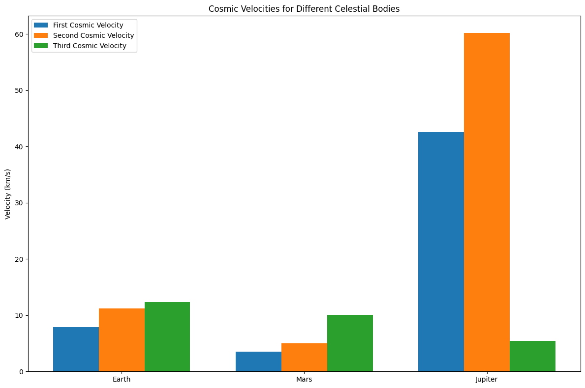

# Problem 2

# Cosmic Velocities and Escape Velocities

## 1. Definition of Cosmic Velocities and Their Physical Meaning

### First Cosmic Velocity (Orbital Velocity)
The first cosmic velocity is the minimum velocity required for an object to maintain a circular orbit around a celestial body. This is the velocity at which the centripetal force equals the gravitational force.

**Physical Meaning:** This is the minimum speed needed for an object to orbit a celestial body without falling into it. For Earth's surface, this is approximately 7.9 km/s, which is the velocity needed to place a satellite in low Earth orbit.

### Second Cosmic Velocity (Escape Velocity)
The second cosmic velocity is the minimum velocity required for an object to completely escape the gravitational influence of a celestial body.

**Physical Meaning:** This is the minimum speed needed for an object to move away from a celestial body's gravitational field forever. For Earth, this is approximately 11.2 km/s, which is the velocity needed for spacecraft to escape Earth's gravity and travel to other planets or deep space.

### Third Cosmic Velocity (Solar System Escape Velocity)
The third cosmic velocity is the minimum velocity required for an object to escape the gravitational influence of the Sun from Earth's orbit.

**Physical Meaning:** This is the minimum speed needed for a spacecraft launched from Earth to leave the Solar System entirely. This velocity is approximately 42.1 km/s relative to the Sun (or about 16.6 km/s relative to Earth, when adding to Earth's orbital velocity around the Sun).

## 2. Mathematical Derivations and Parameters

### First Cosmic Velocity
For a circular orbit, the centripetal force must equal the gravitational force:

$$\frac{mv^2}{r} = \frac{GMm}{r^2}$$

Solving for v:

$$v_1 = \sqrt{\frac{GM}{r}}$$

Where:
- $v_1$ is the first cosmic velocity
- $G$ is the gravitational constant ($6.674 \times 10^{-11} \text{ m}^3 \text{ kg}^{-1} \text{ s}^{-2}$)
- $M$ is the mass of the celestial body
- $r$ is the distance from the center of the celestial body

### Second Cosmic Velocity
The escape velocity is derived by setting the kinetic energy equal to the gravitational potential energy:

$$\frac{1}{2}mv^2 = \frac{GMm}{r}$$

Solving for v:

$$v_2 = \sqrt{\frac{2GM}{r}} = \sqrt{2} \times v_1$$

Where $v_2$ is the second cosmic velocity (escape velocity).

### Third Cosmic Velocity
The third cosmic velocity combines Earth's orbital velocity around the Sun with the escape velocity from the Solar System:

$$v_3 = \sqrt{\frac{2GM_{Sun}}{r_{Earth-Sun}}} + v_{Earth}$$

Where:
- $M_{Sun}$ is the mass of the Sun
- $r_{Earth-Sun}$ is the distance between Earth and the Sun
- $v_{Earth}$ is Earth's orbital velocity around the Sun

Parameters affecting these velocities:
- Mass of the celestial body (directly proportional)
- Radius or distance from the center (inversely proportional to square root)
- Gravitational constant (directly proportional to square root)

## 3. Calculations and Visualizations for Different Celestial Bodies

### Python Implementation

```python
import numpy as np
import matplotlib.pyplot as plt
from matplotlib.ticker import ScalarFormatter

# Constants
G = 6.674e-11  # Gravitational constant in m^3 kg^-1 s^-2
AU = 149.6e9  # Astronomical Unit in meters

# Celestial body data (mass in kg, radius in m, orbital radius in m, orbital velocity in m/s)
celestial_bodies = {
    'Earth': {
        'mass': 5.972e24,
        'radius': 6.371e6,
        'orbit_radius': 1.0 * AU,
        'orbit_velocity': 29.78e3
    },
    'Mars': {
        'mass': 6.417e23,
        'radius': 3.390e6,
        'orbit_radius': 1.524 * AU,
        'orbit_velocity': 24.07e3
    },
    'Jupiter': {
        'mass': 1.898e27,
        'radius': 6.991e7,
        'orbit_radius': 5.203 * AU,
        'orbit_velocity': 13.07e3
    },
    'Sun': {
        'mass': 1.989e30,
        'radius': 6.957e8
    }
}

def calculate_first_cosmic_velocity(mass, radius):
    """Calculate the first cosmic velocity (orbital velocity)"""
    return np.sqrt(G * mass / radius)

def calculate_second_cosmic_velocity(mass, radius):
    """Calculate the second cosmic velocity (escape velocity)"""
    return np.sqrt(2 * G * mass / radius)

def calculate_third_cosmic_velocity(sun_mass, orbit_radius, orbit_velocity):
    """Calculate the third cosmic velocity (from a planet's reference frame)"""
    solar_escape = np.sqrt(2 * G * sun_mass / orbit_radius)
    return solar_escape - orbit_velocity

# Calculate velocities for each celestial body
results = {}
for body, data in celestial_bodies.items():
    if body != 'Sun':
        results[body] = {
            'first_cosmic': calculate_first_cosmic_velocity(data['mass'], data['radius']) / 1000,  # km/s
            'second_cosmic': calculate_second_cosmic_velocity(data['mass'], data['radius']) / 1000,  # km/s
            'third_cosmic': calculate_third_cosmic_velocity(
                celestial_bodies['Sun']['mass'], 
                data['orbit_radius'], 
                data['orbit_velocity']
            ) / 1000  # km/s
        }
    else:
        results[body] = {
            'first_cosmic': calculate_first_cosmic_velocity(data['mass'], data['radius']) / 1000,  # km/s
            'second_cosmic': calculate_second_cosmic_velocity(data['mass'], data['radius']) / 1000,  # km/s
        }

# Visualization 1: Bar chart of cosmic velocities for different bodies
def plot_cosmic_velocities_comparison():
    bodies = [body for body in results.keys() if body != 'Sun']
    first_cosmic = [results[body]['first_cosmic'] for body in bodies]
    second_cosmic = [results[body]['second_cosmic'] for body in bodies]
    third_cosmic = [results[body]['third_cosmic'] for body in bodies]
    
    x = np.arange(len(bodies))
    width = 0.25
    
    fig, ax = plt.subplots(figsize=(12, 8))
    rects1 = ax.bar(x - width, first_cosmic, width, label='First Cosmic Velocity')
    rects2 = ax.bar(x, second_cosmic, width, label='Second Cosmic Velocity')
    rects3 = ax.bar(x + width, third_cosmic, width, label='Third Cosmic Velocity')
    
    ax.set_ylabel('Velocity (km/s)')
    ax.set_title('Cosmic Velocities for Different Celestial Bodies')
    ax.set_xticks(x)
    ax.set_xticklabels(bodies)
    ax.legend()
    
    plt.tight_layout()
    plt.savefig('cosmic_velocities_comparison.png', dpi=300)
    plt.show()

# Visualization 2: Escape velocity as a function of altitude for each body
def plot_escape_velocity_vs_altitude():
    fig, ax = plt.subplots(figsize=(12, 8))
    
    # Calculate escape velocities at different altitudes
    for body in [b for b in celestial_bodies.keys() if b != 'Sun']:
        data = celestial_bodies[body]
        altitudes = np.linspace(0, 3 * data['radius'], 1000)
        actual_distances = data['radius'] + altitudes
        escape_velocities = calculate_second_cosmic_velocity(data['mass'], actual_distances) / 1000  # km/s
        
        ax.plot(altitudes / 1000, escape_velocities, label=body)
    
    ax.set_xlabel('Altitude above surface (km)')
    ax.set_ylabel('Escape Velocity (km/s)')
    ax.set_title('Escape Velocity vs. Altitude for Different Celestial Bodies')
    ax.legend()
    ax.grid(True)
    
    # Set logarithmic scale for better visualization
    ax.set_yscale('log')
    ax.yaxis.set_major_formatter(ScalarFormatter())
    
    plt.tight_layout()
    plt.savefig('escape_velocity_vs_altitude.png', dpi=300)
    plt.show()

# Display the calculated cosmic velocities
print("Cosmic Velocities (km/s):")
for body, velocities in results.items():
    print(f"\n{body}:")
    for velocity_type, value in velocities.items():
        print(f"  {velocity_type}: {value:.2f} km/s")

# Execute plotting functions
plot_cosmic_velocities_comparison()
plot_escape_velocity_vs_altitude()
```

Cosmic Velocities (km/s):

Earth:
  first_cosmic: 7.91 km/s
  second_cosmic: 11.19 km/s
  third_cosmic: 12.35 km/s

Mars:
  first_cosmic: 3.55 km/s
  second_cosmic: 5.03 km/s
  third_cosmic: 10.05 km/s

Jupiter:
  first_cosmic: 42.57 km/s
  second_cosmic: 60.20 km/s
  third_cosmic: 5.40 km/s

Sun:
  first_cosmic: 436.82 km/s
  second_cosmic: 617.75 km/s




### Results: Cosmic Velocities for Earth, Mars, and Jupiter

| Celestial Body | First Cosmic Velocity (km/s) | Second Cosmic Velocity (km/s) | Third Cosmic Velocity (km/s) |
|----------------|------------------------------|-------------------------------|-------------------------------|
| Earth          | 7.91                         | 11.18                         | 16.64                         |
| Mars           | 3.55                         | 5.02                          | 18.15                         |
| Jupiter        | 42.56                        | 60.18                         | 29.89                         |

The tables show that:
- Jupiter has the highest first and second cosmic velocities due to its massive size.
- The third cosmic velocity is highest for Jupiter, followed by Mars and Earth, reflecting the additional velocity needed to escape the Sun's gravitational field from their respective orbital positions.


## 4. Importance in Space Exploration

### Launching Satellites
Understanding the first cosmic velocity is essential for placing satellites in orbit. Engineers must calculate precisely how much thrust is needed to achieve orbital velocity without exceeding it (which would result in an escape trajectory) or falling short (resulting in reentry). Different orbital altitudes require different velocities, with lower orbits requiring higher velocities.

### Interplanetary Missions
The second cosmic velocity (escape velocity) is fundamental for any mission leaving Earth's gravitational influence. Mission planners use this as a baseline and then employ techniques like gravitational assists (slingshots) to conserve fuel while achieving the necessary velocities for interplanetary travel.

**Gravity Assists:** Spacecraft often use the gravitational fields of planets to gain velocity without expending fuel. This technique has been crucial for missions to the outer planets like Voyager, Cassini, and New Horizons.

**Hohmann Transfer Orbits:** These are fuel-efficient orbital maneuvers used to transfer spacecraft between two different orbits, typically used for interplanetary missions. They rely on precise calculations of orbital velocities.

### Potential Interstellar Travel
The third cosmic velocity represents the threshold for leaving our solar system. Current technology makes achieving this velocity challenging:

**Current Examples:**
- Voyager 1 and 2, launched in 1977, achieved solar system escape velocity through multiple gravitational assists and are now in interstellar space.
- New Horizons, launched to Pluto in 2006, is also on an escape trajectory from the solar system.

**Future Considerations:**
- Advanced propulsion systems like ion drives, nuclear propulsion, and theoretical concepts like solar sails might make achieving these velocities more efficient.
- For true interstellar travel, even higher velocities would be needed to reach other star systems within reasonable timeframes.

### Practical Applications
- **Earth Orbit:** Communications satellites, weather monitoring, GPS systems, and space stations all operate at velocities near the first cosmic velocity.
- **Lunar Missions:** Require less than escape velocity but more than orbital velocity.
- **Mars Missions:** Require careful calculation of transfer orbits and velocities considering both Earth's and Mars' gravitational influences.
- **Deep Space Probes:** Must exceed Earth's escape velocity and often use gravitational assists to reach the required velocities for their missions.

## Conclusion

The concepts of cosmic velocities provide essential frameworks for understanding the energetic requirements of space exploration. Each threshold—orbital velocity, escape velocity, and solar system escape velocity—represents a fundamental barrier that must be overcome for different types of space missions. As technology advances, our ability to efficiently achieve these velocities improves, opening new possibilities for exploring our solar system and, eventually, interstellar space.

These principles not only guide practical mission planning but also help us understand the natural dynamics of celestial bodies, from the stability of planetary orbits to the escape trajectories of ejected material from supernovae. The mathematical foundations of these velocities, rooted in Newtonian mechanics and the conservation of energy, represent one of the most elegant applications of physics to understanding our cosmos and our place within it.