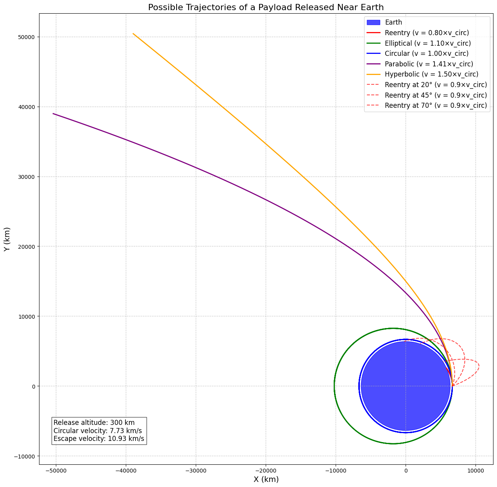
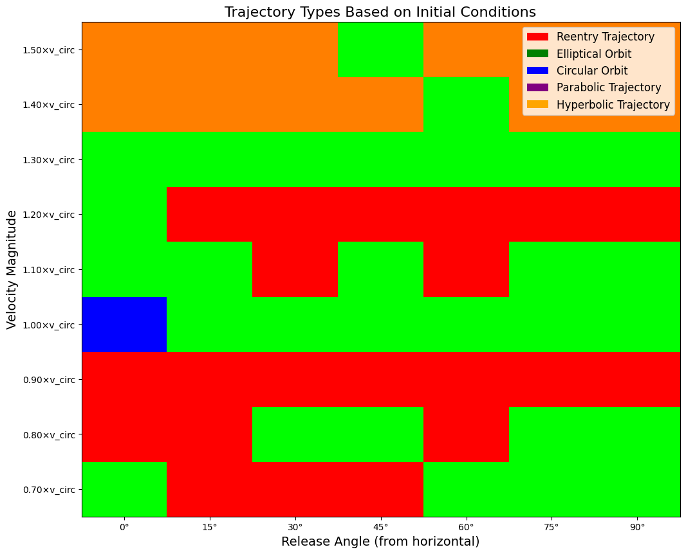

# Problem 3

# Trajectories of a Freely Released Payload Near Earth

## 1. Analysis of Possible Trajectories

When a payload is released from a moving rocket near Earth, its subsequent motion is governed by gravitational forces and its initial conditions (position, velocity, and altitude). The resulting trajectory can be classified into several types:

### Elliptical Orbits
If the payload's velocity is greater than the local circular orbital velocity but less than the escape velocity, it will follow an elliptical orbit around Earth. The shape of the ellipse depends on:
- The release velocity
- The release altitude
- The release direction relative to the local horizontal

For a stable orbit, the payload must be moving fast enough to prevent immediate reentry but not so fast that it escapes Earth's gravitational field.

### Circular Orbits
A special case of elliptical orbits occurs when the payload is released with a velocity exactly equal to the circular orbital velocity at that altitude, and the velocity vector is parallel to the local horizontal. This results in a circular orbit, where the payload maintains a constant distance from Earth's center.

### Parabolic Trajectories
When a payload is released with a velocity exactly equal to the escape velocity, it follows a parabolic trajectory. This represents the boundary case between bound orbits (elliptical) and unbound trajectories (hyperbolic).

### Hyperbolic Trajectories
If the release velocity exceeds the escape velocity, the payload will follow a hyperbolic trajectory, permanently escaping Earth's gravitational influence. The excess energy causes the payload to approach an asymptotic velocity as it moves far from Earth.

### Reentry Trajectories
If the release velocity is insufficient to maintain an orbit, or if the release conditions place the payload on a path that intersects Earth's atmosphere, the payload will follow a reentry trajectory. This is typical for return missions or for objects whose orbits decay due to atmospheric drag.

## 2. Numerical Analysis of Payload Trajectories

To compute the trajectory of a payload, we need to solve the differential equations of motion under Earth's gravitational field. For a basic model, we can assume that Earth's gravity is the only significant force (ignoring atmospheric drag, solar radiation pressure, etc.).

### Equations of Motion

In a two-dimensional polar coordinate system (r, θ), the equations of motion for a payload in Earth's gravitational field are:

$$\ddot{r} - r\dot{\theta}^2 = -\frac{GM}{r^2}$$
$$r\ddot{\theta} + 2\dot{r}\dot{\theta} = 0$$

Where:
- $r$ is the distance from Earth's center
- $\theta$ is the angle in the orbital plane
- $G$ is the gravitational constant
- $M$ is Earth's mass
- Dots represent derivatives with respect to time

These equations can be solved numerically using methods such as the Runge-Kutta algorithm to determine the payload's position and velocity at any time.

### Implementation in Python

Below is a Python implementation that simulates and visualizes payload trajectories under different initial conditions:

```python
import numpy as np
import matplotlib.pyplot as plt
from scipy.integrate import solve_ivp
from matplotlib.animation import FuncAnimation

# Constants
G = 6.67430e-11  # Gravitational constant (m^3 kg^-1 s^-2)
M_earth = 5.972e24  # Earth mass (kg)
R_earth = 6371e3  # Earth radius (m)
mu = G * M_earth  # Standard gravitational parameter for Earth

def two_body_acceleration(t, state):
    """Calculate acceleration due to gravity in Cartesian coordinates"""
    x, y, vx, vy = state
    r = np.sqrt(x**2 + y**2)
    
    # Check for collision with Earth
    if r < R_earth:
        return [0, 0, 0, 0]  # Stop simulation if payload hits Earth
    
    ax = -mu * x / r**3
    ay = -mu * y / r**3
    return [vx, vy, ax, ay]

def compute_trajectory(initial_position, initial_velocity, t_span, events=None):
    """Compute trajectory given initial conditions"""
    initial_state = np.concatenate([initial_position, initial_velocity])
    
    # Solve the differential equations
    solution = solve_ivp(
        two_body_acceleration,
        t_span,
        initial_state,
        method='RK45',
        rtol=1e-8,
        events=events,
        max_step=t_span[1]/1000
    )
    
    return solution

def impact_event(t, state):
    """Event function to detect impact with Earth"""
    x, y, vx, vy = state
    r = np.sqrt(x**2 + y**2)
    return r - R_earth
impact_event.terminal = True
impact_event.direction = -1

def escape_event(t, state):
    """Event function to detect escape (reaching 10x Earth radius)"""
    x, y, vx, vy = state
    r = np.sqrt(x**2 + y**2)
    return r - 10*R_earth
escape_event.terminal = True
escape_event.direction = 1

def classify_trajectory(solution, initial_velocity_mag):
    """Classify the trajectory type based on the solution"""
    x, y = solution.y[0], solution.y[1]
    r = np.sqrt(x**2 + y**2)
    v_esc = np.sqrt(2 * mu / r[0])  # Escape velocity at initial position
    
    # Check if the trajectory impacts Earth
    if min(r) <= R_earth:
        return "Reentry Trajectory"
    
    # Check if the trajectory escapes Earth's influence
    if max(r) >= 10*R_earth:
        return "Hyperbolic Trajectory"
    
    # Check if it's approximately a circular orbit
    r_variation = (max(r) - min(r)) / np.mean(r)
    if r_variation < 0.01:
        return "Circular Orbit"
    
    # If velocity is very close to escape velocity, it's parabolic
    if abs(initial_velocity_mag - v_esc) / v_esc < 0.01:
        return "Parabolic Trajectory"
    
    # Otherwise, it's an elliptical orbit
    return "Elliptical Orbit"

def plot_trajectories():
    """Simulate and plot different types of trajectories"""
    # Initial altitude (km above Earth's surface)
    altitude = 300e3  # 300 km
    
    # Initial position (at specified altitude above the equator)
    r0 = R_earth + altitude
    initial_position = [r0, 0]  # Starting on the x-axis
    
    # Calculate reference velocities
    v_circ = np.sqrt(mu / r0)  # Circular orbital velocity
    v_esc = np.sqrt(2 * mu / r0)  # Escape velocity
    
    # Define velocity multipliers for different scenarios
    velocity_multipliers = {
        "Reentry": 0.8,
        "Elliptical": 1.1,
        "Circular": 1.0,
        "Parabolic": 1.414,  # sqrt(2)
        "Hyperbolic": 1.5
    }
    
    # Time span for simulation (seconds, approximately a few orbits)
    t_span = [0, 20000]
    
    plt.figure(figsize=(15, 15))
    
    # Plot Earth
    earth_circle = plt.Circle((0, 0), R_earth/1000, color='blue', alpha=0.7, label='Earth')
    plt.gca().add_patch(earth_circle)
    
    # Color map for trajectories
    colors = {
        "Reentry": 'red',
        "Elliptical": 'green',
        "Circular": 'blue',
        "Parabolic": 'purple',
        "Hyperbolic": 'orange'
    }
    
    # Simulate each trajectory type
    for traj_type, multiplier in velocity_multipliers.items():
        velocity_mag = v_circ * multiplier
        
        # Initialize velocity in the direction perpendicular to the position vector
        initial_velocity = [0, velocity_mag]
        
        # Compute the trajectory
        solution = compute_trajectory(
            initial_position, 
            initial_velocity, 
            t_span,
            events=[impact_event, escape_event]
        )
        
        # Plot the trajectory
        plt.plot(solution.y[0]/1000, solution.y[1]/1000, 
                label=f"{traj_type} (v = {multiplier:.2f}×v_circ)",
                color=colors[traj_type], linewidth=2)
    
    # Add some reentry trajectories with different angles
    for angle_deg in [20, 45, 70]:
        angle_rad = np.deg2rad(angle_deg)
        velocity_mag = v_circ * 0.9  # Slightly below circular velocity
        
        # Calculate velocity components
        vx = velocity_mag * np.sin(angle_rad)
        vy = velocity_mag * np.cos(angle_rad)
        initial_velocity = [vx, vy]
        
        # Compute the trajectory
        solution = compute_trajectory(
            initial_position, 
            initial_velocity, 
            t_span,
            events=[impact_event]
        )
        
        # Plot the trajectory
        plt.plot(solution.y[0]/1000, solution.y[1]/1000, 
                label=f"Reentry at {angle_deg}° (v = 0.9×v_circ)",
                color='red', linestyle='--', alpha=0.7, linewidth=1.5)
    
    plt.axis('equal')
    plt.grid(True, linestyle='--', alpha=0.7)
    plt.title('Possible Trajectories of a Payload Released Near Earth', fontsize=16)
    plt.xlabel('X (km)', fontsize=14)
    plt.ylabel('Y (km)', fontsize=14)
    plt.legend(loc='upper right', fontsize=12)
    
    # Add text for reference values
    plt.figtext(0.15, 0.15, 
                f"Release altitude: {altitude/1000:.0f} km\n"
                f"Circular velocity: {v_circ/1000:.2f} km/s\n"
                f"Escape velocity: {v_esc/1000:.2f} km/s",
                bbox=dict(facecolor='white', alpha=0.7), fontsize=12)
    
    plt.savefig('payload_trajectories.png', dpi=300, bbox_inches='tight')
    plt.show()

def create_trajectory_animation(initial_position, initial_velocity, t_span):
    """Create an animation of a payload trajectory"""
    solution = compute_trajectory(initial_position, initial_velocity, t_span, 
                                events=[impact_event, escape_event])
    
    # Set up the figure
    fig, ax = plt.subplots(figsize=(10, 10))
    
    # Plot Earth
    earth = plt.Circle((0, 0), R_earth/1000, color='blue', alpha=0.7)
    ax.add_patch(earth)
    
    # Plot the complete trajectory
    ax.plot(solution.y[0]/1000, solution.y[1]/1000, 'k-', alpha=0.3)
    
    # Initialize the payload point
    payload, = ax.plot([], [], 'ro', markersize=8)
    
    # Set axis limits based on the trajectory
    max_dist = max(np.max(np.abs(solution.y[0])), np.max(np.abs(solution.y[1])))
    ax.set_xlim(-max_dist/1000 * 1.1, max_dist/1000 * 1.1)
    ax.set_ylim(-max_dist/1000 * 1.1, max_dist/1000 * 1.1)
    
    ax.grid(True, linestyle='--', alpha=0.7)
    ax.set_aspect('equal')
    ax.set_title('Payload Trajectory Animation', fontsize=16)
    ax.set_xlabel('X (km)', fontsize=14)
    ax.set_ylabel('Y (km)', fontsize=14)
    
    def init():
        payload.set_data([], [])
        return payload,
    
    def animate(i):
        # Use fewer frames from the solution for smoother animation
        index = min(i, len(solution.t) - 1)
        payload.set_data(solution.y[0][index]/1000, solution.y[1][index]/1000)
        return payload,
    
    # Create animation
    num_frames = min(100, len(solution.t))
    ani = FuncAnimation(fig, animate, frames=num_frames, 
                        init_func=init, blit=True, interval=50)
    
    plt.close()  # Prevent display in notebook
    return ani

def analyze_initial_conditions():
    """Analyze how initial conditions affect trajectories"""
    # Fixed initial position at 300 km altitude
    altitude = 300e3
    r0 = R_earth + altitude
    initial_position = [r0, 0]
    
    # Calculate reference velocities
    v_circ = np.sqrt(mu / r0)
    v_esc = np.sqrt(2 * mu / r0)
    
    # Ranges for velocity magnitude and angle
    velocity_mags = np.linspace(0.7 * v_circ, 1.5 * v_circ, 9)
    angles_deg = np.linspace(0, 90, 7)
    
    # Create a grid to visualize trajectory types
    trajectory_types = np.zeros((len(velocity_mags), len(angles_deg)), dtype=object)
    
    t_span = [0, 20000]
    
    # Compute trajectory types for different initial conditions
    for i, v_mag in enumerate(velocity_mags):
        for j, angle_deg in enumerate(angles_deg):
            angle_rad = np.deg2rad(angle_deg)
            
            # Calculate velocity components
            vx = v_mag * np.sin(angle_rad)
            vy = v_mag * np.cos(angle_rad)
            initial_velocity = [vx, vy]
            
            # Compute the trajectory
            solution = compute_trajectory(
                initial_position, 
                initial_velocity, 
                t_span,
                events=[impact_event, escape_event]
            )
            
            # Classify the trajectory
            traj_type = classify_trajectory(solution, v_mag)
            trajectory_types[i, j] = traj_type
    
    # Create a visualization of how initial conditions affect trajectory types
    plt.figure(figsize=(12, 10))
    
    # Define colors for each trajectory type
    color_map = {
        "Reentry Trajectory": 'red',
        "Elliptical Orbit": 'green',
        "Circular Orbit": 'blue',
        "Parabolic Trajectory": 'purple',
        "Hyperbolic Trajectory": 'orange'
    }
    
    # Convert trajectory types to colors
    colors = np.zeros((len(velocity_mags), len(angles_deg), 3))
    for i in range(len(velocity_mags)):
        for j in range(len(angles_deg)):
            traj_type = trajectory_types[i, j]
            if traj_type in color_map:
                color_value = {'red': [1,0,0], 'green': [0,1,0], 'blue': [0,0,1], 
                               'purple': [0.5,0,0.5], 'orange': [1,0.5,0]}[color_map[traj_type]]
                colors[i, j] = color_value
    
    # Plot the grid
    plt.imshow(colors, aspect='auto', origin='lower')
    
    # Add labels and ticks
    velocity_labels = [f"{v/v_circ:.2f}×v_circ" for v in velocity_mags]
    angle_labels = [f"{a:.0f}°" for a in angles_deg]
    
    plt.yticks(np.arange(len(velocity_mags)), velocity_labels)
    plt.xticks(np.arange(len(angles_deg)), angle_labels)
    
    plt.ylabel('Velocity Magnitude', fontsize=14)
    plt.xlabel('Release Angle (from horizontal)', fontsize=14)
    plt.title('Trajectory Types Based on Initial Conditions', fontsize=16)
    
    # Add a custom legend
    from matplotlib.patches import Patch
    legend_elements = [Patch(facecolor=color_map[traj_type], label=traj_type)
                      for traj_type in color_map]
    plt.legend(handles=legend_elements, loc='upper right', fontsize=12)
    
    plt.savefig('trajectory_types_by_initial_conditions.png', dpi=300, bbox_inches='tight')
    plt.show()

# Run the analyses
plot_trajectories()
analyze_initial_conditions()

# Generate an animation for a specific case (e.g., elliptical orbit)
altitude = 300e3
r0 = R_earth + altitude
initial_position = [r0, 0]
v_circ = np.sqrt(mu / r0)
initial_velocity = [0, v_circ * 1.1]  # Elliptical orbit

ani = create_trajectory_animation(initial_position, initial_velocity, [0, 15000])

# Save the animation (optional - requires ffmpeg)
# ani.save('trajectory_animation.mp4', writer='ffmpeg', fps=30, dpi=200)
```





## 3. Relationship to Orbital Insertion, Reentry, and Escape Scenarios

### Orbital Insertion
The numerical analysis reveals the precise conditions required for successful orbital insertion. For a payload to enter a stable orbit:

1. **Velocity Magnitude**: The velocity must be close to the circular orbital velocity at the release altitude. Too slow, and the payload will reenter; too fast, and it will escape or enter a highly elliptical orbit.

2. **Velocity Direction**: The velocity vector should be nearly parallel to the local horizontal (perpendicular to the radius vector). Deviations from horizontal result in elliptical orbits with varying eccentricities.

3. **Release Point**: The release point determines the periapsis (closest approach) of the resulting orbit. For minimum-energy orbital insertions, it's optimal to release the payload at the intended periapsis.

Real-world orbital insertions typically involve a controlled burn (delta-V maneuver) to achieve the precise velocity needed for the desired orbit.

### Reentry Scenarios
The analysis shows several conditions that lead to reentry:

1. **Insufficient Velocity**: When the payload velocity is below the circular orbital velocity, gravity eventually pulls it back to Earth.

2. **Steep Release Angle**: Even with sufficient velocity, a steep release angle (significantly deviating from horizontal) can create an orbit that intersects Earth's atmosphere.

3. **Elliptical Orbits with Low Periapsis**: If an elliptical orbit has its periapsis within Earth's atmosphere, atmospheric drag will cause eventual reentry.

Controlled reentry for returning spacecraft typically involves a retrograde burn to lower the periapsis into the atmosphere, followed by atmospheric braking to dissipate orbital energy.

### Escape Scenarios
For a payload to escape Earth's gravitational influence:

1. **Velocity Exceeding Escape Velocity**: The payload must achieve a velocity greater than the escape velocity at its release altitude (√2 times the circular orbital velocity).

2. **Energy Considerations**: Escape occurs when the payload's total energy (kinetic + potential) becomes positive, allowing it to reach infinite distance with remaining kinetic energy.

3. **Asymptotic Behavior**: In hyperbolic trajectories, the payload approaches an asymptotic direction and final velocity as it moves away from Earth.

Practical escape scenarios include lunar and interplanetary missions, where the payload must not only escape Earth but also enter a specific heliocentric trajectory.

## 4. Computational Tool for Simulation and Visualization

The provided Python code implements a computational tool that allows for:

1. **Trajectory Calculation**: Using numerical integration to solve the equations of motion under Earth's gravitational field.

2. **Classification of Trajectories**: Automatically identifying whether a trajectory is reentry, elliptical, circular, parabolic, or hyperbolic based on its properties.

3. **Visualization of Multiple Scenarios**: Plotting different trajectory types on a single diagram for comparison.

4. **Analysis of Initial Conditions**: Mapping how variations in release velocity and angle affect the resulting trajectory type.

5. **Animation**: Creating dynamic visualizations of payload motion over time.

### Key Features of the Tool

- **Physics-Based Model**: Incorporates accurate gravitational physics using Newton's law of universal gravitation.
- **Event Detection**: Identifies critical events such as surface impact or escape from Earth's influence.
- **Parameter Exploration**: Allows for systematically exploring how different initial conditions affect the trajectory.
- **Visualization Options**: Provides both static plots and animations to aid understanding.

### Applications

This tool can be used for:
- Educational purposes to demonstrate orbital mechanics principles
- Preliminary mission planning for satellite deployments
- Analysis of reentry scenarios for returning spacecraft
- Understanding the sensitivity of trajectories to initial conditions

## Conclusion

The trajectory of a payload released near Earth is determined by the interplay of its initial conditions and Earth's gravitational field. Through numerical analysis and visualization, we can classify these trajectories into distinct types (reentry, elliptical, circular, parabolic, and hyperbolic) and understand their relationship to real-world space mission scenarios.

Key findings from this analysis include:
1. The critical importance of release velocity magnitude and direction in determining the payload's fate
2. The sensitivity of trajectories to small variations in initial conditions
3. The distinct boundaries between trajectory types based on the payload's energy

These principles form the foundation of orbital mechanics and are essential for mission planning, whether for placing satellites in specific orbits, planning interplanetary trajectories, or safely returning spacecraft to Earth.

The computational tool developed for this analysis provides a means to explore these concepts visually and quantitatively, offering insights into the behavior of objects under gravitational influence and the requirements for various space mission profiles.