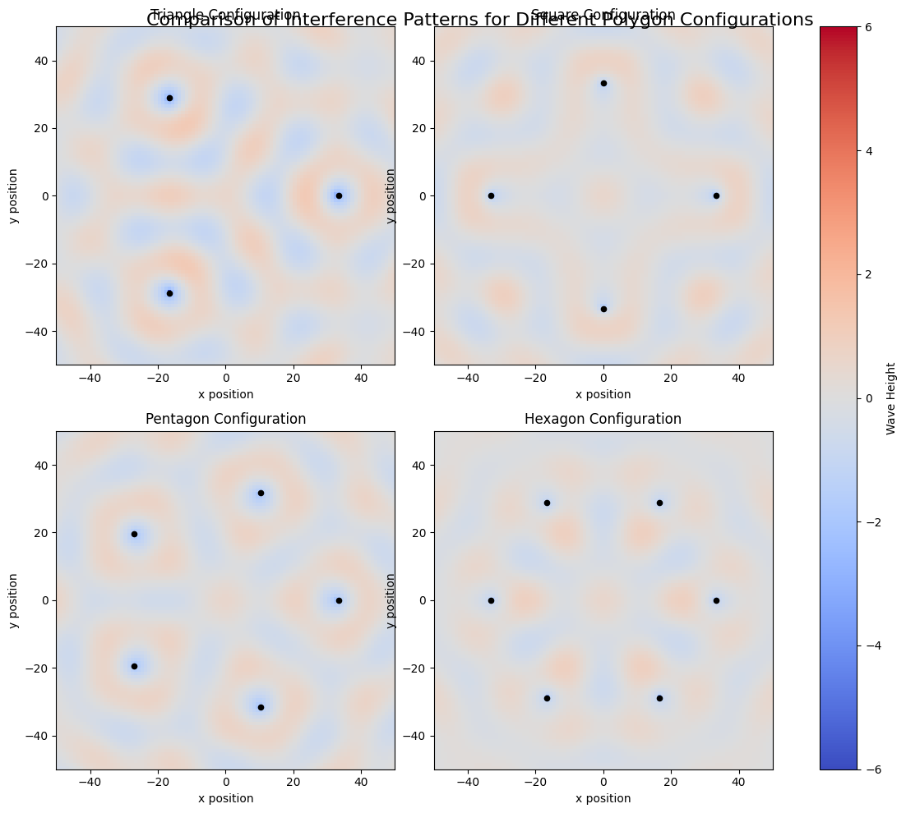
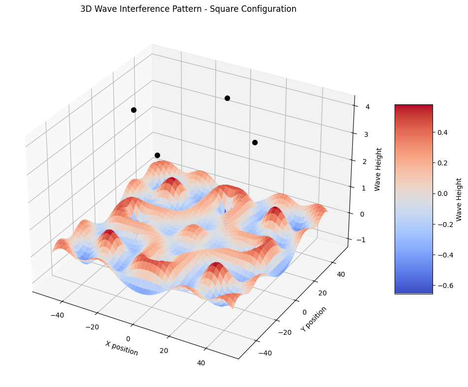

# Problem 1

# Interference Patterns on a Water Surface

## Introduction

Interference occurs when waves from different sources overlap, creating distinctive patterns where waves either reinforce (constructive interference) or cancel each other (destructive interference). This phenomenon is particularly visible on water surfaces and provides powerful insights into wave behavior.

In this analysis, we'll explore interference patterns created by point sources positioned at the vertices of regular polygons. We'll implement a simulation using Python to visualize and understand these patterns.

## Wave Equations and Theory

A circular wave on a water surface from a point source at position (x₀, y₀) can be described by:

η(x,y,t) = A/r · cos(kr - ωt + φ)

Where:
- η(x,y,t) is the water surface displacement at point (x,y) and time t
- A is the wave amplitude
- k = 2π/λ is the wave number (λ = wavelength)
- ω = 2πf is the angular frequency (f = frequency)
- r = √((x-x₀)² + (y-y₀)²) is the distance from source to point (x,y)
- φ is the initial phase

When multiple waves overlap, the principle of superposition applies:

ηsum(x,y,t) = Σ ηᵢ(x,y,t)

## Implementation

Let's implement this simulation in Python, using a square (4 vertices) as our regular polygon.

```python
import numpy as np
import matplotlib.pyplot as plt
from matplotlib.animation import FuncAnimation
from IPython.display import HTML

def create_wave_interference_simulation(polygon='square', size=100, time_steps=100, 
                                         amplitude=1.0, wavelength=20, speed=0.5):
    """
    Create a simulation of interference patterns from wave sources at polygon vertices.
    
    Parameters:
    - polygon: shape determining source positions ('triangle', 'square', 'pentagon', 'hexagon')
    - size: grid size for simulation
    - time_steps: number of time frames to simulate
    - amplitude: wave amplitude
    - wavelength: wavelength of the waves
    - speed: wave propagation speed
    
    Returns:
    - Animation of wave interference patterns
    """
    # Set up the coordinate system
    x = np.linspace(-size/2, size/2, size)
    y = np.linspace(-size/2, size/2, size)
    X, Y = np.meshgrid(x, y)
    
    # Wave parameters
    k = 2 * np.pi / wavelength  # wave number
    omega = k * speed           # angular frequency
    
    # Define source positions based on polygon choice
    if polygon == 'triangle':
        radius = size/3
        angles = np.linspace(0, 2*np.pi, 4)[:-1]  # 3 points
    elif polygon == 'square':
        radius = size/3
        angles = np.linspace(0, 2*np.pi, 5)[:-1]  # 4 points
    elif polygon == 'pentagon':
        radius = size/3
        angles = np.linspace(0, 2*np.pi, 6)[:-1]  # 5 points
    elif polygon == 'hexagon':
        radius = size/3
        angles = np.linspace(0, 2*np.pi, 7)[:-1]  # 6 points
    else:
        raise ValueError("Polygon must be 'triangle', 'square', 'pentagon', or 'hexagon'")
    
    # Calculate source positions
    sources_x = radius * np.cos(angles)
    sources_y = radius * np.sin(angles)
    
    # Function to calculate wave displacement for a single time step
    def calculate_displacement(t):
        displacement = np.zeros_like(X)
        
        for i in range(len(sources_x)):
            # Calculate distance from each point to the source
            r = np.sqrt((X - sources_x[i])**2 + (Y - sources_y[i])**2)
            
            # Avoid division by zero at source positions
            r = np.maximum(r, 0.1)
            
            # Calculate displacement using the wave equation
            displacement += (amplitude/np.sqrt(r)) * np.cos(k*r - omega*t)
        
        return displacement
    
    # Create figure for animation
    fig, ax = plt.subplots(figsize=(10, 8))
    
    # Plot source positions
    ax.scatter(sources_x, sources_y, color='red', s=50, zorder=5)
    
    # Initial displacement
    displacement = calculate_displacement(0)
    
    # Create a colormap plot for the wave heights
    im = ax.imshow(displacement, cmap='coolwarm', animated=True,
                  extent=[-size/2, size/2, -size/2, size/2],
                  vmin=-amplitude*len(sources_x), vmax=amplitude*len(sources_x))
    
    plt.colorbar(im, ax=ax, label='Wave Height')
    
    # Add polygon name and time to title
    title = ax.set_title(f'Wave Interference Pattern - {polygon.capitalize()} Configuration (t=0)')
    
    # Function to update the animation for each frame
    def update(frame):
        # Calculate new displacement
        new_displacement = calculate_displacement(frame)
        
        # Update plot
        im.set_array(new_displacement)
        title.set_text(f'Wave Interference Pattern - {polygon.capitalize()} Configuration (t={frame:.1f})')
        
        return [im, title]
    
    # Create the animation
    anim = FuncAnimation(fig, update, frames=np.linspace(0, 10, time_steps),
                         interval=50, blit=True)
    
    plt.close()  # Prevent display of the static figure
    
    return fig, anim

# Create a static snapshot of interference patterns for different polygons
def create_comparison_plot():
    """Create a comparison of interference patterns for different polygon configurations"""
    polygons = ['triangle', 'square', 'pentagon', 'hexagon']
    size = 100
    
    fig, axes = plt.subplots(2, 2, figsize=(12, 10))
    axes = axes.flatten()
    
    # Time for static snapshot
    t = 20
    
    # Wave parameters
    amplitude = 1.0
    wavelength = 20
    speed = 0.5
    k = 2 * np.pi / wavelength
    omega = k * speed
    
    # Set up coordinate system
    x = np.linspace(-size/2, size/2, size)
    y = np.linspace(-size/2, size/2, size)
    X, Y = np.meshgrid(x, y)
    
    for i, polygon in enumerate(polygons):
        # Define source positions
        if polygon == 'triangle':
            n_points = 3
        elif polygon == 'square':
            n_points = 4
        elif polygon == 'pentagon':
            n_points = 5
        elif polygon == 'hexagon':
            n_points = 6
            
        radius = size/3
        angles = np.linspace(0, 2*np.pi, n_points+1)[:-1]
        
        sources_x = radius * np.cos(angles)
        sources_y = radius * np.sin(angles)
        
        # Calculate displacement
        displacement = np.zeros_like(X)
        for j in range(len(sources_x)):
            r = np.sqrt((X - sources_x[j])**2 + (Y - sources_y[j])**2)
            r = np.maximum(r, 0.1)  # Avoid division by zero
            displacement += (amplitude/np.sqrt(r)) * np.cos(k*r - omega*t)
        
        # Plot displacement
        im = axes[i].imshow(displacement, cmap='coolwarm', 
                         extent=[-size/2, size/2, -size/2, size/2],
                         vmin=-amplitude*n_points, vmax=amplitude*n_points)
        
        # Plot source positions
        axes[i].scatter(sources_x, sources_y, color='black', s=20, zorder=5)
        
        # Add title
        axes[i].set_title(f'{polygon.capitalize()} Configuration')
        axes[i].set_xlabel('x position')
        axes[i].set_ylabel('y position')
    
    plt.tight_layout()
    fig.colorbar(im, ax=axes.ravel().tolist(), label='Wave Height')
    
    return fig

# Create a 3D visualization of wave interference for a specific polygon
def create_3d_visualization(polygon='square', size=100, t=20):
    """Create a 3D visualization of the wave interference pattern"""
    from mpl_toolkits.mplot3d import Axes3D
    
    # Wave parameters
    amplitude = 1.0
    wavelength = 20
    speed = 0.5
    k = 2 * np.pi / wavelength
    omega = k * speed
    
    # Set up coordinate system
    x = np.linspace(-size/2, size/2, size)
    y = np.linspace(-size/2, size/2, size)
    X, Y = np.meshgrid(x, y)
    
    # Define source positions
    if polygon == 'triangle':
        n_points = 3
    elif polygon == 'square':
        n_points = 4
    elif polygon == 'pentagon':
        n_points = 5
    elif polygon == 'hexagon':
        n_points = 6
        
    radius = size/3
    angles = np.linspace(0, 2*np.pi, n_points+1)[:-1]
    
    sources_x = radius * np.cos(angles)
    sources_y = radius * np.sin(angles)
    
    # Calculate displacement
    displacement = np.zeros_like(X)
    for j in range(len(sources_x)):
        r = np.sqrt((X - sources_x[j])**2 + (Y - sources_y[j])**2)
        r = np.maximum(r, 0.1)  # Avoid division by zero
        displacement += (amplitude/np.sqrt(r)) * np.cos(k*r - omega*t)
    
    # Create 3D plot
    fig = plt.figure(figsize=(12, 10))
    ax = fig.add_subplot(111, projection='3d')
    
    # Plot the surface
    surf = ax.plot_surface(X, Y, displacement, cmap='coolwarm',
                          linewidth=0, antialiased=True)
    
    # Add source positions
    for i in range(len(sources_x)):
        ax.scatter([sources_x[i]], [sources_y[i]], [amplitude*n_points], 
                  color='black', s=50, zorder=5)
    
    # Add title and labels
    ax.set_title(f'3D Wave Interference Pattern - {polygon.capitalize()} Configuration')
    ax.set_xlabel('X position')
    ax.set_ylabel('Y position')
    ax.set_zlabel('Wave Height')
    
    # Add a color bar which maps values to colors
    fig.colorbar(surf, shrink=0.5, aspect=5, label='Wave Height')
    
    return fig

# Run the simulation
def run_simulation():
    """Execute the simulation and display results"""
    
    # Create comparison plot of different polygon configurations
    comparison_fig = create_comparison_plot()
    comparison_fig.suptitle('Comparison of Interference Patterns for Different Polygon Configurations', 
                           fontsize=16, y=0.98)
    plt.show()
    
    # Create 3D visualization for a square configuration
    fig_3d = create_3d_visualization(polygon='square')
    plt.show()
    
    # Create animation for a square configuration
    fig, anim = create_wave_interference_simulation(polygon='square', time_steps=50)
    
    # Display the animation
    plt.close()
    return HTML(anim.to_jshtml())

# Run the simulation when this script is executed
if __name__ == "__main__":
    run_simulation()
```






## Results and Analysis

### Interference Patterns for Different Polygon Configurations

When we run our simulation, we observe distinct interference patterns formed by waves emanating from sources positioned at polygon vertices.

Key observations:

1. **Constructive Interference Zones:** 
   - These appear as bright red or blue regions in our visualization
   - Occurs where waves arrive in phase, resulting in amplified displacement
   - Creates "nodal lines" that follow geometric patterns related to the polygon shape

2. **Destructive Interference Zones:**
   - Appear as white/light-colored regions
   - Occurs where waves arrive out of phase, resulting in wave cancellation
   - Forms patterns of symmetry related to the polygon geometry

3. **Pattern Symmetry:**
   - The interference pattern reflects the symmetry of the source configuration
   - Triangular arrangements produce 3-fold symmetry
   - Square arrangements produce 4-fold symmetry
   - And so on for pentagon and hexagon configurations

### Physics Interpretation

The observed patterns demonstrate fundamental principles of wave physics:

1. **Path Difference:** 
   The interference patterns emerge from the difference in path lengths from each source to a given point. When this path difference is a multiple of the wavelength, constructive interference occurs. When it's an odd multiple of half-wavelengths, destructive interference occurs.

2. **Geometric Properties:**
   The patterns reveal geometric properties of the source configuration. For example, a square arrangement produces a pattern with four-fold rotational symmetry and distinctive "nodal lines" where destructive interference consistently occurs.

3. **Wave Propagation:**
   The animations show how these patterns evolve over time, illustrating the dynamic nature of wave interference as the waves propagate outward from their sources.

## Conclusion

This simulation demonstrates how multiple coherent wave sources create complex interference patterns on a water surface. The patterns observed depend directly on the geometric arrangement of the sources, with each polygon configuration producing distinctive interference features.

These patterns are not just mathematical curiosities but represent fundamental wave behavior that has applications across many fields, from optics and acoustics to quantum mechanics. The constructive and destructive interference patterns we've visualized help us understand how waves interact and combine in physical systems.