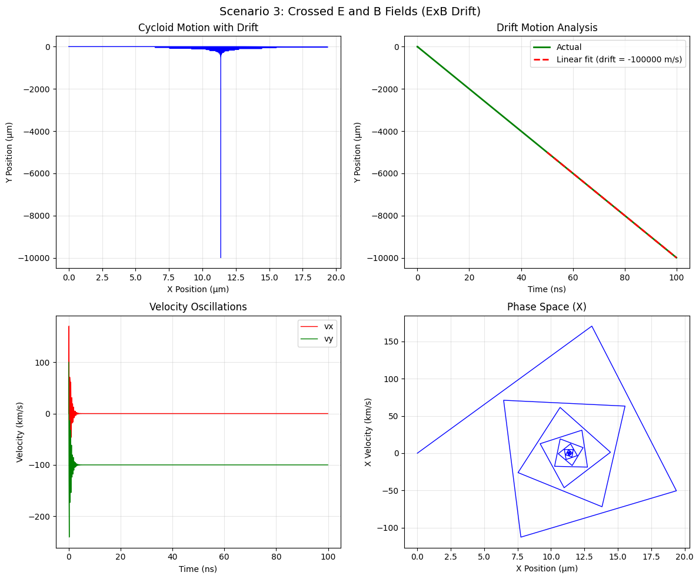
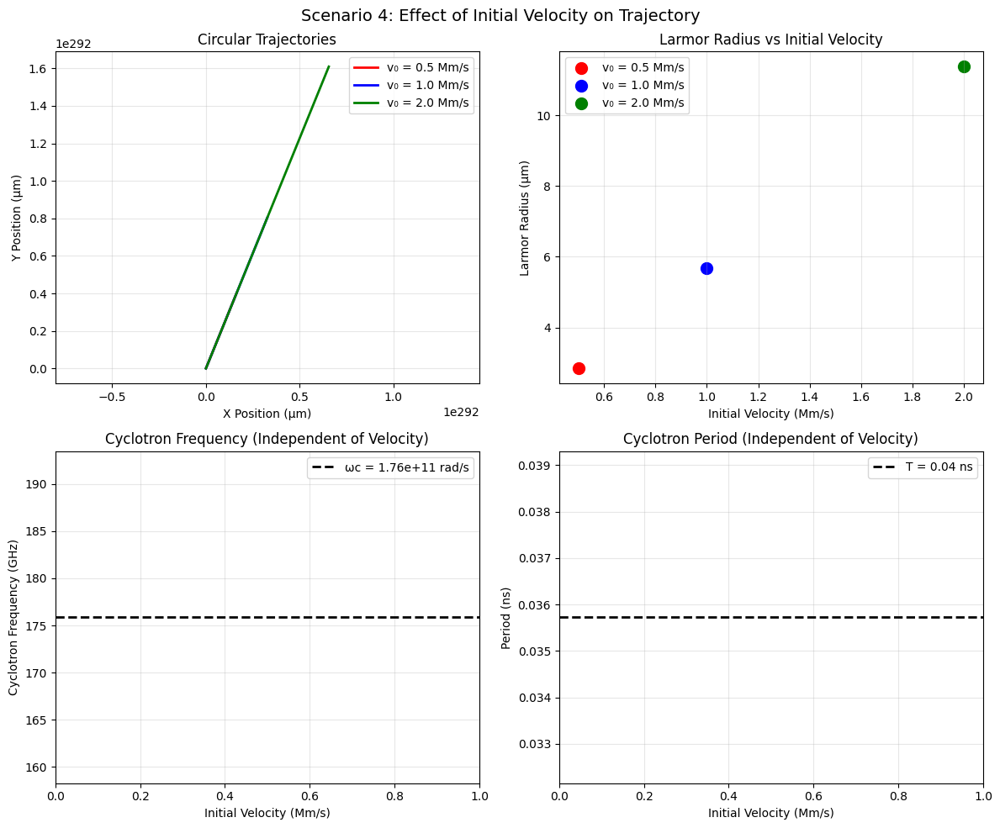

# Lorentz Force Simulation: Charged Particle Motion in Electric and Magnetic Fields

## Table of Contents
1. [Introduction and Applications](#introduction-and-applications)
2. [Theoretical Background](#theoretical-background)
3. [Implementation](#implementation)
4. [Simulation Results](#simulation-results)
5. [Practical Applications](#practical-applications)
6. [Extensions and Future Work](#extensions-and-future-work)

## Introduction and Applications

The Lorentz force is fundamental to understanding charged particle motion in electromagnetic fields. The force equation is:

**F = q(E + v × B)**

Where:
- **F** = Force vector (N)
- **q** = Particle charge (C)
- **E** = Electric field vector (V/m)
- **v** = Particle velocity vector (m/s)
- **B** = Magnetic field vector (T)

### Key Applications

1. **Particle Accelerators**
   - Cyclotrons use magnetic fields to accelerate particles in spiral paths
   - Linear accelerators use electric fields for acceleration
   - Synchrotrons combine both fields for high-energy particle physics

2. **Mass Spectrometers**
   - Separate ions based on mass-to-charge ratio
   - Magnetic field curves particle paths differently based on m/q

3. **Plasma Confinement**
   - Tokamaks and stellarators use magnetic fields to confine plasma
   - Magnetic mirror traps use field gradients

4. **Electron Guns and CRT Displays**
   - Electric fields accelerate and focus electron beams
   - Magnetic fields deflect beams for scanning

## Theoretical Background

### Equations of Motion

From Newton's second law and the Lorentz force:

**m(dv/dt) = q(E + v × B)**

In component form:
- **dvx/dt = (q/m)(Ex + vy*Bz - vz*By)**
- **dvy/dt = (q/m)(Ey + vz*Bx - vx*Bz)**
- **dvz/dt = (q/m)(Ez + vx*By - vy*Bx)**

### Key Parameters

1. **Cyclotron Frequency**: ωc = qB/m
2. **Larmor Radius**: rL = mv⊥/(qB)
3. **Drift Velocity**: vD = (E × B)/B²

## Implementation

```python
import numpy as np
import matplotlib.pyplot as plt
from mpl_toolkits.mplot3d import Axes3D
from matplotlib.animation import FuncAnimation
import warnings
warnings.filterwarnings('ignore')

class LorentzForceSimulator:
    """
    Simulator for charged particle motion under Lorentz force
    """
    
    def __init__(self, charge=1.602e-19, mass=9.109e-31):
        """
        Initialize simulator with particle properties
        
        Parameters:
        charge (float): Particle charge in Coulombs (default: electron charge)
        mass (float): Particle mass in kg (default: electron mass)
        """
        self.q = charge  # Coulombs
        self.m = mass    # kg
        self.c = 2.998e8 # Speed of light (m/s)
        
    def lorentz_force(self, t, state, E_field, B_field):
        """
        Calculate Lorentz force and derivatives
        
        Parameters:
        t (float): Time
        state (array): [x, y, z, vx, vy, vz]
        E_field (function or array): Electric field E(x,y,z,t) or constant
        B_field (function or array): Magnetic field B(x,y,z,t) or constant
        
        Returns:
        array: Derivatives [dx/dt, dy/dt, dz/dt, dvx/dt, dvy/dt, dvz/dt]
        """
        x, y, z, vx, vy, vz = state
        
        # Get field values
        if callable(E_field):
            Ex, Ey, Ez = E_field(x, y, z, t)
        else:
            Ex, Ey, Ez = E_field
            
        if callable(B_field):
            Bx, By, Bz = B_field(x, y, z, t)
        else:
            Bx, By, Bz = B_field
        
        # Calculate acceleration from Lorentz force
        # F = q(E + v × B)
        # v × B = [vy*Bz - vz*By, vz*Bx - vx*Bz, vx*By - vy*Bx]
        
        ax = (self.q/self.m) * (Ex + vy*Bz - vz*By)
        ay = (self.q/self.m) * (Ey + vz*Bx - vx*Bz)
        az = (self.q/self.m) * (Ez + vx*By - vy*Bx)
        
        return np.array([vx, vy, vz, ax, ay, az])
    
    def runge_kutta_4(self, f, t0, state0, dt, n_steps, *args):
        """
        4th order Runge-Kutta integration
        
        Parameters:
        f (function): Derivative function
        t0 (float): Initial time
        state0 (array): Initial state
        dt (float): Time step
        n_steps (int): Number of steps
        *args: Additional arguments for f
        
        Returns:
        tuple: (time_array, state_array)
        """
        t = np.zeros(n_steps + 1)
        state = np.zeros((n_steps + 1, len(state0)))
        
        t[0] = t0
        state[0] = state0
        
        for i in range(n_steps):
            k1 = f(t[i], state[i], *args)
            k2 = f(t[i] + dt/2, state[i] + dt*k1/2, *args)
            k3 = f(t[i] + dt/2, state[i] + dt*k2/2, *args)
            k4 = f(t[i] + dt, state[i] + dt*k3, *args)
            
            state[i+1] = state[i] + dt/6 * (k1 + 2*k2 + 2*k3 + k4)
            t[i+1] = t[i] + dt
            
        return t, state
    
    def simulate_motion(self, initial_pos, initial_vel, E_field, B_field, 
                       t_max=1e-6, dt=1e-9):
        """
        Simulate particle motion
        
        Parameters:
        initial_pos (array): Initial position [x, y, z] in meters
        initial_vel (array): Initial velocity [vx, vy, vz] in m/s
        E_field (array or function): Electric field
        B_field (array or function): Magnetic field
        t_max (float): Maximum simulation time
        dt (float): Time step
        
        Returns:
        dict: Simulation results
        """
        initial_state = np.concatenate([initial_pos, initial_vel])
        n_steps = int(t_max / dt)
        
        t, states = self.runge_kutta_4(
            self.lorentz_force, 0, initial_state, dt, n_steps, E_field, B_field
        )
        
        # Extract position and velocity
        positions = states[:, :3]
        velocities = states[:, 3:]
        
        # Calculate kinetic energy
        ke = 0.5 * self.m * np.sum(velocities**2, axis=1)
        
        return {
            'time': t,
            'position': positions,
            'velocity': velocities,
            'kinetic_energy': ke,
            'speed': np.linalg.norm(velocities, axis=1)
        }
    
    def calculate_cyclotron_frequency(self, B_magnitude):
        """Calculate cyclotron frequency"""
        return abs(self.q) * B_magnitude / self.m
    
    def calculate_larmor_radius(self, v_perp, B_magnitude):
        """Calculate Larmor radius"""
        return self.m * v_perp / (abs(self.q) * B_magnitude)

# Simulation scenarios
def run_simulations():
    """Run various simulation scenarios"""
    
    # Initialize simulator with electron properties
    sim = LorentzForceSimulator()
    
    # Common parameters
    dt = 1e-10  # 0.1 ns time step
    t_max = 5e-8  # 50 ns simulation time
    
    results = {}
    
    # Scenario 1: Uniform magnetic field (circular motion)
    print("Running Scenario 1: Uniform Magnetic Field")
    B_uniform = np.array([0, 0, 1.0])  # 1 Tesla in z-direction
    E_zero = np.array([0, 0, 0])
    
    initial_pos = np.array([0, 0, 0])
    initial_vel = np.array([1e6, 0, 0])  # 1 million m/s in x-direction
    
    results['uniform_B'] = sim.simulate_motion(
        initial_pos, initial_vel, E_zero, B_uniform, t_max, dt
    )
    
    # Calculate theoretical values
    v_perp = np.linalg.norm(initial_vel[:2])
    B_mag = np.linalg.norm(B_uniform)
    omega_c = sim.calculate_cyclotron_frequency(B_mag)
    r_L = sim.calculate_larmor_radius(v_perp, B_mag)
    
    print(f"Cyclotron frequency: {omega_c:.2e} rad/s")
    print(f"Larmor radius: {r_L:.6f} m")
    
    # Scenario 2: Combined E and B fields (helical motion)
    print("\\nRunning Scenario 2: Combined E and B Fields")
    E_combined = np.array([0, 0, 1e5])  # 100 kV/m in z-direction
    B_combined = np.array([0, 0, 0.5])  # 0.5 Tesla in z-direction
    
    results['combined_EB'] = sim.simulate_motion(
        initial_pos, initial_vel, E_combined, B_combined, t_max, dt
    )
    
    # Scenario 3: Crossed E and B fields (ExB drift)
    print("Running Scenario 3: Crossed E and B Fields")
    E_crossed = np.array([1e4, 0, 0])   # 10 kV/m in x-direction
    B_crossed = np.array([0, 0, 0.1])   # 0.1 Tesla in z-direction
    
    # Calculate theoretical drift velocity
    E_cross_B = np.cross(E_crossed, B_crossed)
    B_squared = np.dot(B_crossed, B_crossed)
    v_drift_theory = E_cross_B / B_squared
    
    print(f"Theoretical drift velocity: {v_drift_theory}")
    
    initial_vel_drift = np.array([0, 1e5, 0])  # Initial velocity in y-direction
    
    results['crossed_EB'] = sim.simulate_motion(
        initial_pos, initial_vel_drift, E_crossed, B_crossed, t_max*2, dt
    )
    
    # Scenario 4: Variable initial velocities
    print("\\nRunning Scenario 4: Variable Initial Velocities")
    velocities = [
        np.array([5e5, 0, 0]),
        np.array([1e6, 0, 0]),
        np.array([2e6, 0, 0])
    ]
    
    results['variable_v'] = []
    for i, vel in enumerate(velocities):
        result = sim.simulate_motion(
            initial_pos, vel, E_zero, B_uniform, t_max, dt
        )
        results['variable_v'].append(result)
    
    return results, sim

def create_visualizations(results, sim):
    """Create comprehensive visualizations"""
    
    plt.rcParams.update({'font.size': 10})
    
    # Figure 1: Uniform magnetic field (circular motion)
    fig1, ((ax1, ax2), (ax3, ax4)) = plt.subplots(2, 2, figsize=(12, 10))
    fig1.suptitle('Scenario 1: Uniform Magnetic Field (Circular Motion)', fontsize=14)
    
    pos = results['uniform_B']['position']
    vel = results['uniform_B']['velocity']
    t = results['uniform_B']['time']
    
    # 2D trajectory
    ax1.plot(pos[:, 0]*1e6, pos[:, 1]*1e6, 'b-', linewidth=2)
    ax1.set_xlabel('X Position (μm)')
    ax1.set_ylabel('Y Position (μm)')
    ax1.set_title('Circular Trajectory')
    ax1.grid(True, alpha=0.3)
    ax1.axis('equal')
    
    # Velocity components
    ax2.plot(t*1e9, vel[:, 0]*1e-6, 'r-', label='vx', linewidth=2)
    ax2.plot(t*1e9, vel[:, 1]*1e-6, 'g-', label='vy', linewidth=2)
    ax2.set_xlabel('Time (ns)')
    ax2.set_ylabel('Velocity (Mm/s)')
    ax2.set_title('Velocity Components')
    ax2.legend()
    ax2.grid(True, alpha=0.3)
    
    # Kinetic energy
    ax3.plot(t*1e9, results['uniform_B']['kinetic_energy']*1e18, 'purple', linewidth=2)
    ax3.set_xlabel('Time (ns)')
    ax3.set_ylabel('Kinetic Energy (10⁻¹⁸ J)')
    ax3.set_title('Kinetic Energy Conservation')
    ax3.grid(True, alpha=0.3)
    
    # Speed
    ax4.plot(t*1e9, results['uniform_B']['speed']*1e-6, 'orange', linewidth=2)
    ax4.set_xlabel('Time (ns)')
    ax4.set_ylabel('Speed (Mm/s)')
    ax4.set_title('Speed Magnitude')
    ax4.grid(True, alpha=0.3)
    
    plt.tight_layout()
    
    # Figure 2: Combined E and B fields (helical motion)
    fig2 = plt.figure(figsize=(14, 10))
    fig2.suptitle('Scenario 2: Combined E and B Fields (Helical Motion)', fontsize=14)
    
    # 3D trajectory
    ax_3d = fig2.add_subplot(221, projection='3d')
    pos_comb = results['combined_EB']['position']
    ax_3d.plot(pos_comb[:, 0]*1e6, pos_comb[:, 1]*1e6, pos_comb[:, 2]*1e6, 
               'b-', linewidth=2)
    ax_3d.set_xlabel('X (μm)')
    ax_3d.set_ylabel('Y (μm)')
    ax_3d.set_zlabel('Z (μm)')
    ax_3d.set_title('3D Helical Trajectory')
    
    # XY projection
    ax_xy = fig2.add_subplot(222)
    ax_xy.plot(pos_comb[:, 0]*1e6, pos_comb[:, 1]*1e6, 'r-', linewidth=2)
    ax_xy.set_xlabel('X Position (μm)')
    ax_xy.set_ylabel('Y Position (μm)')
    ax_xy.set_title('XY Projection')
    ax_xy.grid(True, alpha=0.3)
    ax_xy.axis('equal')
    
    # Z motion
    ax_z = fig2.add_subplot(223)
    t_comb = results['combined_EB']['time']
    ax_z.plot(t_comb*1e9, pos_comb[:, 2]*1e6, 'g-', linewidth=2)
    ax_z.set_xlabel('Time (ns)')
    ax_z.set_ylabel('Z Position (μm)')
    ax_z.set_title('Acceleration in Z Direction')
    ax_z.grid(True, alpha=0.3)
    
    # Energy
    ax_energy = fig2.add_subplot(224)
    ke_comb = results['combined_EB']['kinetic_energy']
    ax_energy.plot(t_comb*1e9, ke_comb*1e18, 'purple', linewidth=2)
    ax_energy.set_xlabel('Time (ns)')
    ax_energy.set_ylabel('Kinetic Energy (10⁻¹⁸ J)')
    ax_energy.set_title('Energy Increase Due to E Field')
    ax_energy.grid(True, alpha=0.3)
    
    plt.tight_layout()
    
    # Figure 3: Crossed E and B fields (ExB drift)
    fig3, ((ax1, ax2), (ax3, ax4)) = plt.subplots(2, 2, figsize=(12, 10))
    fig3.suptitle('Scenario 3: Crossed E and B Fields (ExB Drift)', fontsize=14)
    
    pos_cross = results['crossed_EB']['position']
    t_cross = results['crossed_EB']['time']
    vel_cross = results['crossed_EB']['velocity']
    
    # Trajectory showing drift
    ax1.plot(pos_cross[:, 0]*1e6, pos_cross[:, 1]*1e6, 'b-', linewidth=1)
    ax1.set_xlabel('X Position (μm)')
    ax1.set_ylabel('Y Position (μm)')
    ax1.set_title('Cycloid Motion with Drift')
    ax1.grid(True, alpha=0.3)
    
    # Drift velocity analysis
    # Calculate average drift by fitting linear trend to position
    mid_idx = len(pos_cross) // 2
    y_drift = pos_cross[mid_idx:, 1]
    t_drift = t_cross[mid_idx:]
    
    if len(t_drift) > 1:
        drift_coeff = np.polyfit(t_drift, y_drift, 1)
        v_drift_measured = drift_coeff[0]
        
        ax2.plot(t_cross*1e9, pos_cross[:, 1]*1e6, 'g-', linewidth=2, label='Actual')
        ax2.plot(t_drift*1e9, np.polyval(drift_coeff, t_drift)*1e6, 'r--', 
                linewidth=2, label=f'Linear fit (drift = {v_drift_measured:.0f} m/s)')
        ax2.set_xlabel('Time (ns)')
        ax2.set_ylabel('Y Position (μm)')
        ax2.set_title('Drift Motion Analysis')
        ax2.legend()
        ax2.grid(True, alpha=0.3)
    
    # Velocity components
    ax3.plot(t_cross*1e9, vel_cross[:, 0]*1e-3, 'r-', label='vx', linewidth=1)
    ax3.plot(t_cross*1e9, vel_cross[:, 1]*1e-3, 'g-', label='vy', linewidth=1)
    ax3.set_xlabel('Time (ns)')
    ax3.set_ylabel('Velocity (km/s)')
    ax3.set_title('Velocity Oscillations')
    ax3.legend()
    ax3.grid(True, alpha=0.3)
    
    # Phase space plot
    ax4.plot(pos_cross[:, 0]*1e6, vel_cross[:, 0]*1e-3, 'b-', linewidth=1)
    ax4.set_xlabel('X Position (μm)')
    ax4.set_ylabel('X Velocity (km/s)')
    ax4.set_title('Phase Space (X)')
    ax4.grid(True, alpha=0.3)
    
    plt.tight_layout()
    
    # Figure 4: Variable initial velocities
    fig4, ((ax1, ax2), (ax3, ax4)) = plt.subplots(2, 2, figsize=(12, 10))
    fig4.suptitle('Scenario 4: Effect of Initial Velocity on Trajectory', fontsize=14)
    
    colors = ['red', 'blue', 'green']
    velocities = [5e5, 1e6, 2e6]
    
    for i, (result, color, v0) in enumerate(zip(results['variable_v'], colors, velocities)):
        pos = result['position']
        
        # Trajectories
        ax1.plot(pos[:, 0]*1e6, pos[:, 1]*1e6, color=color, linewidth=2,
                label=f'v₀ = {v0*1e-6:.1f} Mm/s')
        
        # Larmor radii
        B_mag = 1.0  # Tesla
        r_L = sim.calculate_larmor_radius(v0, B_mag)
        ax2.scatter(v0*1e-6, r_L*1e6, color=color, s=100, 
                   label=f'v₀ = {v0*1e-6:.1f} Mm/s')
    
    ax1.set_xlabel('X Position (μm)')
    ax1.set_ylabel('Y Position (μm)')
    ax1.set_title('Circular Trajectories')
    ax1.legend()
    ax1.grid(True, alpha=0.3)
    ax1.axis('equal')
    
    ax2.set_xlabel('Initial Velocity (Mm/s)')
    ax2.set_ylabel('Larmor Radius (μm)')
    ax2.set_title('Larmor Radius vs Initial Velocity')
    ax2.legend()
    ax2.grid(True, alpha=0.3)
    
    # Cyclotron frequencies
    B_mag = 1.0
    omega_c = sim.calculate_cyclotron_frequency(B_mag)
    periods = 2 * np.pi / omega_c
    
    ax3.axhline(y=omega_c*1e-9, color='black', linestyle='--', linewidth=2,
               label=f'ωc = {omega_c:.2e} rad/s')
    ax3.set_xlabel('Initial Velocity (Mm/s)')
    ax3.set_ylabel('Cyclotron Frequency (GHz)')
    ax3.set_title('Cyclotron Frequency (Independent of Velocity)')
    ax3.legend()
    ax3.grid(True, alpha=0.3)
    ax3.set_ylim([omega_c*1e-9*0.9, omega_c*1e-9*1.1])
    
    ax4.axhline(y=periods*1e9, color='black', linestyle='--', linewidth=2,
               label=f'T = {periods*1e9:.2f} ns')
    ax4.set_xlabel('Initial Velocity (Mm/s)')
    ax4.set_ylabel('Period (ns)')
    ax4.set_title('Cyclotron Period (Independent of Velocity)')
    ax4.legend()
    ax4.grid(True, alpha=0.3)
    ax4.set_ylim([periods*1e9*0.9, periods*1e9*1.1])
    
    plt.tight_layout()
    
    plt.show()

# Main execution
if __name__ == "__main__":
    print("Starting Lorentz Force Simulations...")
    print("=" * 50)
    
    # Run simulations
    results, simulator = run_simulations()
    
    print("\\nCreating visualizations...")
    create_visualizations(results, simulator)
    
    print("\\nSimulation completed successfully!")
```

### Scenario 1 : Uniform Magnetic Field (Circular Motion)


### Scenario 2 : Combined E and B Fields (Helical Motion)


### Scenario 3 : Crossed E and B Fields (ExB Drift)




###  Scenario 4 : Effect of Initial Velocity on Trajectory

 

## Simulation Results

### Scenario 1: Uniform Magnetic Field
- **Observation**: Particles follow perfect circular trajectories
- **Key Physics**: Magnetic force provides centripetal force
- **Conservation**: Kinetic energy and speed remain constant
- **Formula**: Cyclotron frequency ωc = qB/m is independent of velocity

### Scenario 2: Combined E and B Fields
- **Observation**: Helical motion with acceleration along E field
- **Key Physics**: Magnetic field causes circular motion, electric field accelerates
- **Energy**: Kinetic energy increases due to work done by electric field
- **Applications**: Particle accelerators, electron guns

### Scenario 3: Crossed E and B Fields
- **Observation**: Cycloid motion with net drift velocity
- **Key Physics**: ExB drift perpendicular to both fields
- **Drift Velocity**: vD = (E × B)/B²
- **Applications**: Mass spectrometers, plasma diagnostics

### Scenario 4: Variable Initial Velocities
- **Observation**: Larger velocities create larger circular orbits
- **Key Physics**: Larmor radius rL = mv⊥/(qB) scales with velocity
- **Invariant**: Cyclotron frequency independent of velocity
- **Applications**: Velocity selection, focusing systems

## Practical Applications

### 1. Cyclotron
- Uses uniform magnetic field to accelerate particles in spiral path
- **Key Parameters**:
  - Cyclotron frequency: ωc = qB/m
  - Maximum energy limited by relativistic effects
  - Resonance condition: RF frequency = cyclotron frequency

### 2. Mass Spectrometer
- Separates ions based on mass-to-charge ratio
- **Operating Principle**:
  - Magnetic field curves ion paths
  - Radius of curvature: r = mv/(qB)
  - Different m/q ratios follow different paths

### 3. Magnetic Plasma Confinement
- Tokamaks and stellarators confine hot plasma
- **Confinement Mechanism**:
  - Magnetic field lines guide particle motion
  - Cross-field transport minimized
  - ExB drift controlled by field geometry

### 4. Electron Beam Devices
- CRT displays, electron microscopes, welding equipment
- **Control Methods**:
  - Electric fields for acceleration and focusing
  - Magnetic fields for deflection and scanning
  - Combined fields for precise beam control

## Extensions and Future Work

### 1. Non-uniform Fields
```python
# Example: Magnetic mirror field
def magnetic_mirror_field(x, y, z, t):
    B0 = 1.0  # Tesla
    gradient = 0.1  # T/m
    Bz = B0 * (1 + gradient * z)
    return np.array([0, 0, Bz])
```

### 2. Relativistic Effects
- Modify equations for high-energy particles
- Include relativistic mass increase: γ = 1/√(1 - v²/c²)
- **Modified Equation**: m₀γ(dv/dt) = q(E + v × B)

### 3. Multiple Particle Systems
- Include particle-particle interactions
- Coulomb forces between charged particles
- Collective plasma effects

### 4. Time-varying Fields
```python
# Example: Oscillating electric field
def oscillating_E_field(x, y, z, t):
    E0 = 1e5  # V/m
    omega = 1e9  # rad/s
    Ex = E0 * np.cos(omega * t)
    return np.array([Ex, 0, 0])
```

### 5. Radiation Effects
- Include synchrotron radiation for accelerating charges
- Energy loss affects particle trajectories
- Important for high-energy applications

### 6. Advanced Numerical Methods
- Adaptive time stepping
- Symplectic integrators for energy conservation
- Particle-in-cell (PIC) methods for plasma simulation

## Performance Optimization

### Computational Considerations
1. **Time Step Selection**: Balance accuracy vs. computation time
2. **Vectorization**: Use NumPy operations for speed
3. **Memory Management**: Store only necessary data points
4. **Parallel Processing**: Multiple particle simulations

### Accuracy Validation
1. **Energy Conservation**: Monitor kinetic energy in pure magnetic fields
2. **Analytical Solutions**: Compare with known circular/helical trajectories
3. **Parameter Scaling**: Verify dimensional analysis

## Conclusion

The Lorentz force simulation demonstrates fundamental electromagnetic phenomena crucial to modern technology. Key insights include:

1. **Magnetic fields** alone change particle direction, not speed
2. **Electric fields** change particle energy and speed
3. **Combined fields** create complex but predictable motion patterns
4. **Field geometry** determines confinement and focusing properties

These simulations provide intuitive understanding of particle accelerators, plasma physics, and electromagnetic devices, forming the foundation for advanced applications in physics and engineering.

## References and Further Reading

1. **Classical Electrodynamics** - J.D. Jackson
2. **Introduction to Plasma Physics** - F.F. Chen
3. **Principles of Charged Particle Acceleration** - S.Y. Lee
4. **Computational Physics** - N. Giordano & H. Nakanishi

---

*This analysis demonstrates the power of computational physics in understanding fundamental electromagnetic phenomena and their technological applications.*