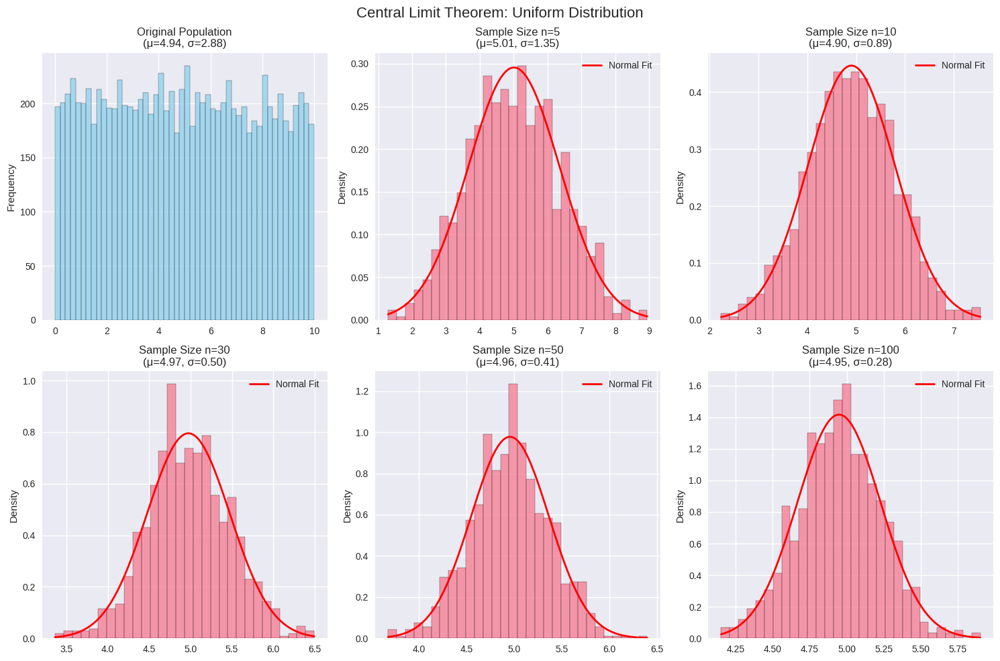
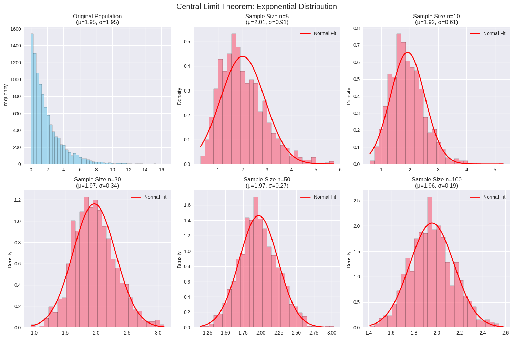
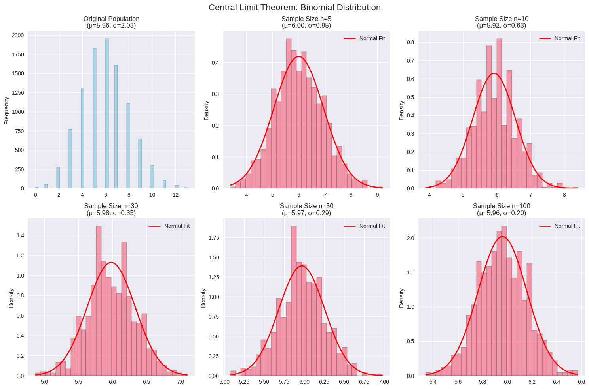
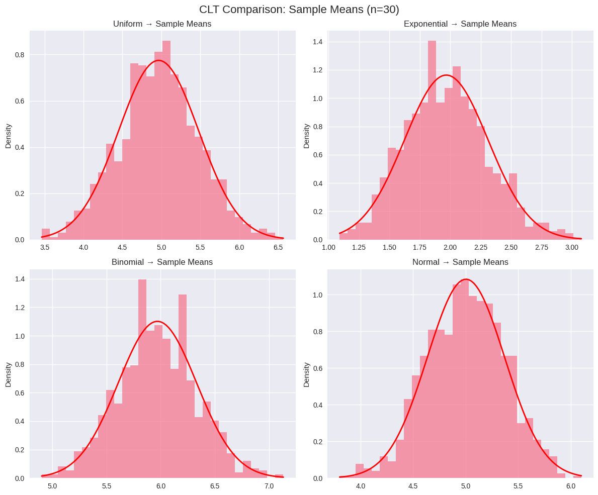

# Problem 1
# Central Limit Theorem Simulation

## Overview
The Central Limit Theorem (CLT) states that the sampling distribution of sample means approaches a normal distribution as sample size increases, regardless of the population's original distribution.

## Implementation

```python
import numpy as np
import matplotlib.pyplot as plt
import seaborn as sns
from scipy import stats
import warnings
warnings.filterwarnings('ignore')

# Set style for better plots
plt.style.use('seaborn-v0_8')
sns.set_palette("husl")

class CLTSimulator:
    def __init__(self, population_size=10000, num_samples=1000):
        self.population_size = population_size
        self.num_samples = num_samples
        
    def generate_population(self, distribution_type):
        """Generate different types of population distributions"""
        np.random.seed(42)
        
        if distribution_type == 'uniform':
            return np.random.uniform(0, 10, self.population_size)
        elif distribution_type == 'exponential':
            return np.random.exponential(2, self.population_size)
        elif distribution_type == 'binomial':
            return np.random.binomial(20, 0.3, self.population_size)
        elif distribution_type == 'normal':
            return np.random.normal(5, 2, self.population_size)
        
    def sample_means(self, population, sample_sizes):
        """Calculate sample means for different sample sizes"""
        results = {}
        
        for n in sample_sizes:
            sample_means = []
            for _ in range(self.num_samples):
                sample = np.random.choice(population, size=n, replace=True)
                sample_means.append(np.mean(sample))
            results[n] = np.array(sample_means)
            
        return results
    
    def plot_distributions(self, population, sample_means_dict, dist_name):
        """Create comprehensive visualization"""
        fig, axes = plt.subplots(2, 3, figsize=(15, 10))
        fig.suptitle(f'Central Limit Theorem: {dist_name.title()} Distribution', fontsize=16)
        
        # Original population
        axes[0, 0].hist(population, bins=50, alpha=0.7, color='skyblue', edgecolor='black')
        axes[0, 0].set_title(f'Original Population\n(μ={np.mean(population):.2f}, σ={np.std(population):.2f})')
        axes[0, 0].set_ylabel('Frequency')
        
        # Sample means for different sample sizes
        sample_sizes = list(sample_means_dict.keys())
        positions = [(0, 1), (0, 2), (1, 0), (1, 1), (1, 2)]
        
        for i, n in enumerate(sample_sizes):
            if i < len(positions):
                row, col = positions[i]
                sample_means = sample_means_dict[n]
                
                # Histogram
                axes[row, col].hist(sample_means, bins=30, alpha=0.7, 
                                  density=True, edgecolor='black')
                
                # Overlay normal distribution
                x = np.linspace(sample_means.min(), sample_means.max(), 100)
                normal_curve = stats.norm.pdf(x, np.mean(sample_means), np.std(sample_means))
                axes[row, col].plot(x, normal_curve, 'r-', linewidth=2, label='Normal Fit')
                
                axes[row, col].set_title(f'Sample Size n={n}\n(μ={np.mean(sample_means):.2f}, σ={np.std(sample_means):.2f})')
                axes[row, col].legend()
                axes[row, col].set_ylabel('Density')
        
        plt.tight_layout()
        plt.show()
        
    def run_simulation(self, distributions=['uniform', 'exponential', 'binomial']):
        """Run complete CLT simulation"""
        sample_sizes = [5, 10, 30, 50, 100]
        
        for dist_type in distributions:
            print(f"\n{'='*50}")
            print(f"SIMULATION: {dist_type.upper()} DISTRIBUTION")
            print(f"{'='*50}")
            
            # Generate population
            population = self.generate_population(dist_type)
            
            # Calculate sample means
            sample_means_dict = self.sample_means(population, sample_sizes)
            
            # Create visualizations
            self.plot_distributions(population, sample_means_dict, dist_type)
            
            # Statistical analysis
            self.analyze_convergence(sample_means_dict, dist_type)
    
    def analyze_convergence(self, sample_means_dict, dist_name):
        """Analyze convergence to normality"""
        print(f"\nConvergence Analysis for {dist_name.title()} Distribution:")
        print("-" * 60)
        print(f"{'Sample Size':<12} {'Mean':<8} {'Std Dev':<8} {'Skewness':<10} {'Kurtosis':<10}")
        print("-" * 60)
        
        for n, means in sample_means_dict.items():
            skewness = stats.skew(means)
            kurtosis = stats.kurtosis(means)
            print(f"{n:<12} {np.mean(means):<8.3f} {np.std(means):<8.3f} "
                  f"{skewness:<10.3f} {kurtosis:<10.3f}")

# Run the simulation
simulator = CLTSimulator(population_size=10000, num_samples=1000)
simulator.run_simulation()

# Additional: Comparison of different distributions
def compare_distributions():
    """Compare CLT effect across different distributions"""
    fig, axes = plt.subplots(2, 2, figsize=(12, 10))
    fig.suptitle('CLT Comparison: Sample Means (n=30)', fontsize=16)
    
    distributions = ['uniform', 'exponential', 'binomial', 'normal']
    simulator = CLTSimulator()
    
    for i, dist_type in enumerate(distributions):
        row, col = i // 2, i % 2
        
        population = simulator.generate_population(dist_type)
        sample_means = simulator.sample_means(population, [30])[30]
        
        axes[row, col].hist(sample_means, bins=30, alpha=0.7, density=True)
        
        # Overlay normal curve
        x = np.linspace(sample_means.min(), sample_means.max(), 100)
        normal_curve = stats.norm.pdf(x, np.mean(sample_means), np.std(sample_means))
        axes[row, col].plot(x, normal_curve, 'r-', linewidth=2)
        
        axes[row, col].set_title(f'{dist_type.title()} → Sample Means')
        axes[row, col].set_ylabel('Density')
    
    plt.tight_layout()
    plt.show()

compare_distributions()
```
## SIMULATION: UNIFORM DISTRIBUTION



## Convergence Analysis for Uniform Distribution:
------------------------------------------------------------
Sample Size  Mean     Std Dev  Skewness   Kurtosis  
------------------------------------------------------------
5            5.007    1.350    0.055      -0.386    
10           4.905    0.893    -0.015     -0.075    
30           4.975    0.501    0.011      0.074     
50           4.958    0.408    -0.043     0.048     
100          4.948    0.282    0.002      0.039     

==================================================
## SIMULATION: EXPONENTIAL DISTRIBUTION
==================================================



## Convergence Analysis for Exponential Distribution:
------------------------------------------------------------
Sample Size  Mean     Std Dev  Skewness   Kurtosis  
------------------------------------------------------------
5            2.009    0.907    0.816      0.683     
10           1.924    0.607    0.805      1.390     
30           1.970    0.343    0.312      0.138     
50           1.969    0.273    0.199      0.055     
100          1.957    0.194    0.190      -0.049    

==================================================
## SIMULATION: BINOMIAL DISTRIBUTION
==================================================



## Convergence Analysis for Binomial Distribution:
------------------------------------------------------------
Sample Size  Mean     Std Dev  Skewness   Kurtosis  
------------------------------------------------------------
5            6.000    0.952    0.127      -0.139    
10           5.923    0.633    0.074      0.140     
30           5.981    0.354    0.043      0.018     
50           5.970    0.287    -0.021     0.052     
100          5.961    0.198    0.028      -0.064    



## Key Observations

### 1. **Convergence Pattern**
- As sample size increases (n: 5 → 100), sampling distributions become more normal
- Standard error decreases as n increases (σ/√n relationship)

### 2. **Distribution Independence**
- CLT works regardless of original distribution shape
- Even highly skewed distributions (exponential) converge to normality

### 3. **Practical Implications**
- **Quality Control**: Sample means of product measurements follow normal distribution
- **Financial Modeling**: Portfolio returns can be modeled using CLT
- **Survey Research**: Sample statistics provide reliable population estimates

### 4. **Mathematical Verification**
- **Standard Error**: σ_x̄ = σ/√n
- **Normality**: Sample means ~ N(μ, σ²/n) for large n
- **Rule of Thumb**: n ≥ 30 usually sufficient for most distributions

## Conclusion

The Central Limit Theorem demonstrates that:
1. Sample means are less variable than individual observations
2. Larger samples produce more reliable estimates
3. Normal distribution emerges naturally from averaging processes
4. Statistical inference becomes possible regardless of population distribution

This fundamental theorem enables most statistical methods and confidence interval calculations used in data science and research.