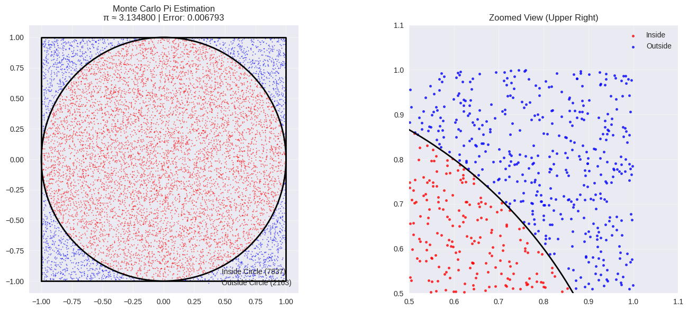

# Problem 2

# Estimating Pi using Monte Carlo Methods

## Overview
Monte Carlo methods use randomness to solve numerical problems. We'll explore two elegant approaches to estimate π: the circle method and Buffon's Needle problem.

## Part 1: Circle-Based Monte Carlo Method

### Theoretical Foundation
- Generate random points in a unit square [-1,1] × [-1,1]
- Count points inside the unit circle (x² + y² ≤ 1)
- **Formula**: π ≈ 4 × (points inside circle / total points)
- **Reasoning**: Circle area = π, Square area = 4, Ratio = π/4

import numpy as np
import matplotlib.pyplot as plt
import seaborn as sns
from matplotlib.patches import Circle

plt.style.use('seaborn-v0_8')
sns.set_palette("husl")

class MonteCarloPI:
    def __init__(self):
        self.results = {}

    def estimate_pi_circle(self, n_points, visualize=False):
        np.random.seed(42)

        x = np.random.uniform(-1, 1, n_points)
        y = np.random.uniform(-1, 1, n_points)

        distances = x**2 + y**2
        inside_circle = distances <= 1

        pi_estimate = 4 * np.sum(inside_circle) / n_points

        if visualize:
            self.visualize_circle_method(x, y, inside_circle, pi_estimate)

        return pi_estimate, inside_circle

    def visualize_circle_method(self, x, y, inside_circle, pi_estimate):
        fig, (ax1, ax2) = plt.subplots(1, 2, figsize=(15, 6))

        inside_x, inside_y = x[inside_circle], y[inside_circle]
        outside_x, outside_y = x[~inside_circle], y[~inside_circle]

        ax1.scatter(inside_x, inside_y, c='red', s=1, alpha=0.6, label=f'Inside Circle ({len(inside_x)})')
        ax1.scatter(outside_x, outside_y, c='blue', s=1, alpha=0.6, label=f'Outside Circle ({len(outside_x)})')

        circle = Circle((0, 0), 1, fill=False, color='black', linewidth=2)
        ax1.add_patch(circle)
        ax1.plot([-1, 1, 1, -1, -1], [-1, -1, 1, 1, -1], 'k-', linewidth=2)

        ax1.set_xlim(-1.1, 1.1)
        ax1.set_ylim(-1.1, 1.1)
        ax1.set_aspect('equal')
        ax1.set_title(f'Monte Carlo Pi Estimation\nπ ≈ {pi_estimate:.6f} | Error: {abs(pi_estimate - np.pi):.6f}')
        ax1.legend()
        ax1.grid(True, alpha=0.3)

        zoom_mask = (x > 0.5) & (y > 0.5)
        zoom_inside = inside_circle[zoom_mask]
        zoom_x, zoom_y = x[zoom_mask], y[zoom_mask]

        ax2.scatter(zoom_x[zoom_inside], zoom_y[zoom_inside], c='red', s=10, alpha=0.8, label='Inside')
        ax2.scatter(zoom_x[~zoom_inside], zoom_y[~zoom_inside], c='blue', s=10, alpha=0.8, label='Outside')

        theta = np.linspace(0, np.pi/2, 100)
        circle_x = np.cos(theta)
        circle_y = np.sin(theta)
        ax2.plot(circle_x, circle_y, 'k-', linewidth=2)

        ax2.set_xlim(0.5, 1.1)
        ax2.set_ylim(0.5, 1.1)
        ax2.set_aspect('equal')
        ax2.set_title('Zoomed View (Upper Right)')
        ax2.legend()
        ax2.grid(True, alpha=0.3)

        plt.tight_layout()
        plt.show()

    def estimate_pi_buffon(self, n_needles, needle_length=1.0, line_distance=1.0):
        if needle_length > line_distance:
            raise ValueError("Needle length must be less than or equal to the line distance.")

        np.random.seed(42)
        theta = np.random.uniform(0, np.pi/2, n_needles)
        d = np.random.uniform(0, line_distance / 2, n_needles)

        hits = d <= (needle_length / 2) * np.sin(theta)
        n_hits = np.sum(hits)

        if n_hits == 0:
            return None, 0

        pi_estimate = (2 * needle_length * n_needles) / (line_distance * n_hits)
        return pi_estimate, n_hits

    def compare_methods(self, n_samples):
        pi_circle, _ = self.estimate_pi_circle(n_samples)
        pi_buffon, hits = self.estimate_pi_buffon(n_samples)

        print(f"Circle Method: π ≈ {pi_circle:.6f}")
        if hits > 0:
            print(f"Buffon's Needle Method: π ≈ {pi_buffon:.6f} (Hits: {hits})")
        else:
            print("Buffon's Needle Method: Not enough hits to estimate π")

# Usage Example:
if __name__ == "__main__":
    simulator = MonteCarloPI()
    print("--- Estimating with Circle Method ---")
    pi_estimate_circle, _ = simulator.estimate_pi_circle(10000, visualize=True)
    print(f"Estimated π (Circle): {pi_estimate_circle:.6f}\n")

    print("--- Estimating with Buffon's Needle Method ---")
    pi_estimate_buffon, hits = simulator.estimate_pi_buffon(10000)
    if hits > 0:
        print(f"Estimated π (Buffon): {pi_estimate_buffon:.6f} (Hits: {hits})")
    else:
        print("Not enough hits in Buffon's Needle method to estimate π")

    print("\n--- Comparison ---")
    simulator.compare_methods(10000)


efficiency_comparison()
```

--- Estimating with Circle Method ---



Estimated π (Circle): 3.134800

--- Estimating with Buffon's Needle Method ---
Estimated π (Buffon): 3.182180 (Hits: 6285)

--- Comparison ---
Circle Method: π ≈ 3.134800
Buffon's Needle Method: π ≈ 3.182180 (Hits: 6285)

## Key Insights

### Convergence Characteristics
1. **Circle Method**: 
   - Faster convergence due to larger sample space
   - Error decreases as O(1/√n)
   - More stable estimates

2. **Buffon's Needle**: 
   - Slower convergence, higher variance
   - Sensitive to crossing events
   - Historical significance in probability theory

### Computational Efficiency
- Circle method is computationally simpler
- Buffon's method requires trigonometric calculations
- Both methods demonstrate Monte Carlo's power

### Practical Applications
- **Quality Control**: Estimating defect rates
- **Finance**: Risk assessment and option pricing
- **Physics**: Particle simulations and nuclear calculations
- **Computer Graphics**: Ray tracing and rendering

### Mathematical Beauty
These methods showcase how random processes can solve deterministic problems, demonstrating the fundamental connection between probability and geometry that underlies much of modern computational mathematics.